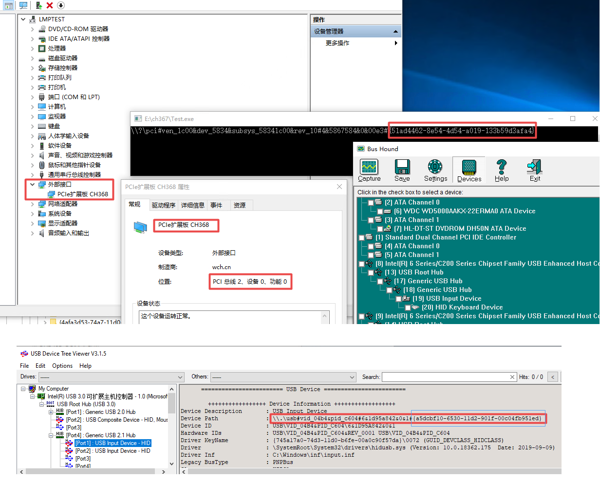
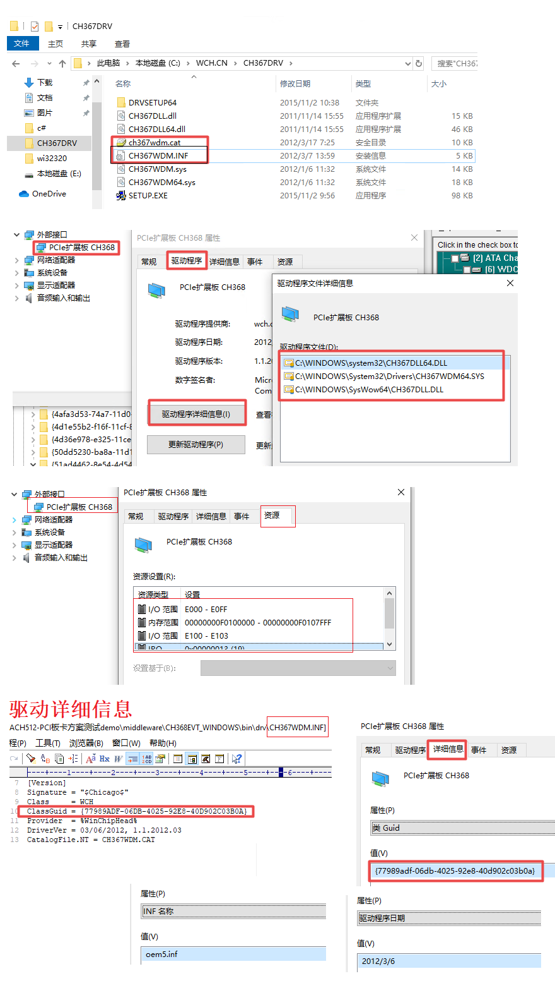

##### 自定义PCIE设备实例枚举到的路径



##### 自定义PCIE设备驱动配置文件在设备中的属性对应



#### Setup ClassGuid与Device Interface ClassGUID  
* {77989adf-06db-4025-92e8-40d902c03b0a}  设备类，与驱动inf配置文件中的一致，在注册表的HKEY_LOCAL_MACHINE\SYSTEM\CurrentControlSet\Control\Class下。
一般使用window提供的固定值，也可以自定义。
常见固定值：

|Class|GUID|Device Description|
|--|--|--|	
|CDROM	|4D36E965-E325-11CE-BFC1-08002BE10318	|CD/DVD/Blu-ray drives|
|DiskDrive|	4D36E967-E325-11CE-BFC1-08002BE10318|	Hard drives|
|Display|	4D36E968-E325-11CE-BFC1-08002BE10318|	Video adapters|
|FDC|	4D36E969-E325-11CE-BFC1-08002BE10318|	Floppy controllers|
|FloppyDisk|	4D36E980-E325-11CE-BFC1-08002BE10318|	Floppy drives|
|HDC|	4D36E96A-E325-11CE-BFC1-08002BE10318|	Hard drive controllers|
|HIDClass|	745A17A0-74D3-11D0-B6FE-00A0C90F57DA|	Some USB devices|
|1394|	6BDD1FC1-810F-11D0-BEC7-08002BE2092F|	IEEE 1394 host controller|
|Image|	6BDD1FC6-810F-11D0-BEC7-08002BE2092F|	Cameras and scanners|
|Keyboard|	4D36E96B-E325-11CE-BFC1-08002BE10318|	Keyboards|
|Modem|	4D36E96D-E325-11CE-BFC1-08002BE10318|	Modems|
|Mouse|	4D36E96F-E325-11CE-BFC1-08002BE10318|	Mice and pointing devices|
|Media|	4D36E96C-E325-11CE-BFC1-08002BE10318|	Audio and video devices|
|Net|	4D36E972-E325-11CE-BFC1-08002BE10318|	Network adapters|
|Ports|	4D36E978-E325-11CE-BFC1-08002BE10318|	Serial and parallel ports|
|SCSIAdapter|	4D36E97B-E325-11CE-BFC1-08002BE10318|	SCSI and RAID controllers|
|System|	4D36E97D-E325-11CE-BFC1-08002BE10318|	System buses, bridges, etc.|
|USB|	36FC9E60-C465-11CF-8056-444553540000|	USB host controllers and hubs|
* {51ad4462-8e54-4d54-a019-133b59d3afa4}  注册接口实例类，给SetupDiGetClassDevs使用，在注册表的HKEY_LOCAL_MACHINE\SYSTEM\CurrentControlSet\Control\DeviceClasses下，通过枚举到的设备路径一般是\\?\pci#ven_1c00&dev_5834&subsys_58341c00&rev_10#4&5867584&0&00e3#{51ad4462-8e54-4d54-a019-133b59d3afa4}


```cpp
Windows Registry Editor Version 5.00

[HKEY_LOCAL_MACHINE\SYSTEM\CurrentControlSet\Control\Class\{77989adf-06db-4025-92e8-40d902c03b0a}]
"Class"="WCH"
"ClassDesc"="@oem5.inf,%ClassName%;Interface"
"Icon"="-5"
"NoInstallClass"="1"
"IconPath"=hex(7):25,00,53,00,79,00,73,00,74,00,65,00,6d,00,52,00,6f,00,6f,00,\
  74,00,25,00,5c,00,53,00,79,00,73,00,74,00,65,00,6d,00,33,00,32,00,5c,00,73,\
  00,65,00,74,00,75,00,70,00,61,00,70,00,69,00,2e,00,64,00,6c,00,6c,00,2c,00,\
  2d,00,35,00,00,00,00,00

[HKEY_LOCAL_MACHINE\SYSTEM\CurrentControlSet\Control\Class\{77989adf-06db-4025-92e8-40d902c03b0a}\0000]
"InfPath"="oem5.inf"
"InfSection"="CH367.Install"
"ProviderName"="wch.cn"
"DriverDateData"=hex:00,40,d5,12,2c,fb,cc,01
"DriverDate"="3-6-2012"
"DriverVersion"="1.1.2012.3"
"MatchingDeviceId"="pci\\ven_1c00&dev_5834&subsys_58341c00"
"DriverDesc"="PCIe扩展板 CH368"
"InfSectionExt"=".NTamd64"

[HKEY_LOCAL_MACHINE\SYSTEM\CurrentControlSet\Control\Class\{77989adf-06db-4025-92e8-40d902c03b0a}\0001]
"InfPath"="oem5.inf"
"InfSection"="CH367.Install"
"ProviderName"="wch.cn"
"DriverDateData"=hex:00,40,d5,12,2c,fb,cc,01
"DriverDate"="3-6-2012"
"DriverVersion"="1.1.2012.3"
"MatchingDeviceId"="pci\\ven_1c00&dev_5834&subsys_58341c00"
"DriverDesc"="PCIe扩展板 CH368"
"InfSectionExt"=".NTamd64"
```
```cpp
[HKEY_LOCAL_MACHINE\SYSTEM\CurrentControlSet\Control\DeviceClasses\{51ad4462-8e54-4d54-a019-133b59d3afa4}]

[HKEY_LOCAL_MACHINE\SYSTEM\CurrentControlSet\Control\DeviceClasses\{51ad4462-8e54-4d54-a019-133b59d3afa4}\##?#PCI#VEN_1C00&DEV_5834&SUBSYS_58341C00&REV_10#4&3811cc07&0&00E4#{51ad4462-8e54-4d54-a019-133b59d3afa4}]
"DeviceInstance"="PCI\\VEN_1C00&DEV_5834&SUBSYS_58341C00&REV_10\\4&3811cc07&0&00E4"

[HKEY_LOCAL_MACHINE\SYSTEM\CurrentControlSet\Control\DeviceClasses\{51ad4462-8e54-4d54-a019-133b59d3afa4}\##?#PCI#VEN_1C00&DEV_5834&SUBSYS_58341C00&REV_10#4&3811cc07&0&00E4#{51ad4462-8e54-4d54-a019-133b59d3afa4}\#]

[HKEY_LOCAL_MACHINE\SYSTEM\CurrentControlSet\Control\DeviceClasses\{51ad4462-8e54-4d54-a019-133b59d3afa4}\##?#PCI#VEN_1C00&DEV_5834&SUBSYS_58341C00&REV_10#4&5867584&0&00E3#{51ad4462-8e54-4d54-a019-133b59d3afa4}]
"DeviceInstance"="PCI\\VEN_1C00&DEV_5834&SUBSYS_58341C00&REV_10\\4&5867584&0&00E3"

[HKEY_LOCAL_MACHINE\SYSTEM\CurrentControlSet\Control\DeviceClasses\{51ad4462-8e54-4d54-a019-133b59d3afa4}\##?#PCI#VEN_1C00&DEV_5834&SUBSYS_58341C00&REV_10#4&5867584&0&00E3#{51ad4462-8e54-4d54-a019-133b59d3afa4}\#]
```

