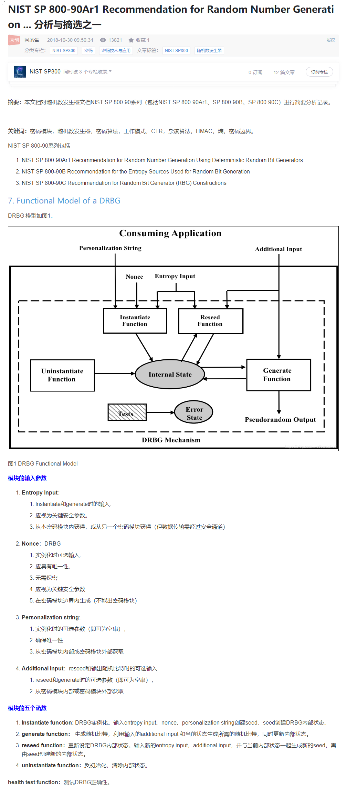

# NRBG  DRBG
non-deterministic random bit generators (NRBGs) 纯物理实现，不可预测
Deterministic Random Bit Generators (DRBGs) 确定性的随机比特生成，使用算法生成

# Nonce /DRBG seeds
Nonce是或Number once的缩写，在密码学中Nonce是一个只被使用一次的任意或非重复的随机数值。

# CRNGT   Condition Random Numeral Generator Test
mToken_DRBGGetEntropy
mToken_DRBGGetEntropyCRNGT

mToken_DRBGGenerate
mToken_DRBGGenerateCRNGT
HalAlgSHA256DRBG_Generate

每当生成随机数时，条件随机数生成器(CRNG)自测运行。如果测试失败，系统将记录系统日志消息。这是按照联邦信息处理标准(FIPS)建议执行的。但是，由于再次生成随机数，因此这种影响是无害的。
根据FIPS，所有RNG必须实施条件随机数生成器测试(CRNGT)。 测试将当前生成的随机数与前一随机数进行比较。如果数字相同，则生成系统日志消息并生成一个随机数。
运行测试是为了确保随机数的唯一性。重新生成编号时，不会影响功能。

NX-OS中有两种类型的随机数生成器(RNG):
FIPS RNG，在openssl加密库中实现
非FIPS RNG，即Linux RNG

# HRNG 物理真随机数发生器(Hardware Random Numeral Generator)
# TRNG 真随机数发生器， 是指利用物理方法实现的随机数发生器。
    它是自然界随机的物理过程（所产物理现象的不确定性）的反映，即使算法等TRNG的所有信息都被暴露，都无法猜测其结果，即高质量的真随机数发生器产生的随机数永远不具备周期性。
# PRNG 伪随机数发生器  
    伪随机数发生器是基于数学算法的随机数发生器，它由真随机的种子和伪随机网络构成。一旦真随机的种子被暴露，伪随机数发生器的结果就是确定了。
# PTRNG    
    PTRNG physical true RNG (short: physical RNG) 
    NPTRNG non-physical true RNG das digitized analog noise signal iid independent and identically distributed pp

真随机数发生器所产生的随机数来源于真实的随机物理过程,因而彻底地消除了伪随机数的周期性问题, 只有真随机数发生器才能提供真正的、永不重复的随机数序列。这对于某些对随机数质量有特殊要求的应用有重要意义。
此外，真随机数发生器产生的随机数与计算机的CPU无关。

# 随机源（熵源 ？）
真随机数发生器是指用物理方法实现的随机数发生器。各种随机物理过程如宇宙噪声、电路的热噪声和放射性衰变均可用来产生随机物理信号。
其中与IC工艺兼容的三种随机源：放大电路噪声、振荡采样、混沌电路。
## 1．电路噪声放大。电路中的噪声主要来源有：散粒噪声、接触噪声、突发噪声、雪崩噪声、热噪声等。在芯片设计中，电路中大电阻的热噪声是最易于获得的随机物理信号。最常见的电阻噪声源电路，它广泛应用于芯片式或板卡式的随机数发生器的设计中。
由于真随机数发生器所需要的是均匀分布的高斯型噪声, 因此在噪声发生器中应尽量突出噪声源电阻所产生的热噪声的贡献,并尽量抑制由运算放大器所产生的1/f噪声和突发噪声等非高斯型的噪声。低噪声运算放大器的噪声指标越低越好。
高速度高性能的数字物理噪声源芯片的核心部分采用噪声迭代环原理来提高输出数据的不可预测性。噪声的影响在这个环内被不断放大，经迭代后，这种噪声的影响就将和电路的初始状态混在一起，使得几次迭代后的电路的状态完全无法估计，当然也就不可预测。
采用参数略微拉开的两路噪声迭代环，在数据处理部分，利用异或来进一步改善数据的比。两路信号异或01还将增加对输出数预测的难度。
## 2．振荡采样法。振荡采样法来产生所需要的随机数。即通过一个高电平触发的D触发器把两个独立的方波进行数字混合，用低速波来采样高速波，这种方法是利用环形振荡器的频率抖动来作为随机源的。
环形振荡器产生低频的时钟作为D触发器的时钟输入端。压控振荡器VCO（或CCO）产生的高频数据作为D触发器的数据输入端。经过D触发器采样输出后，产生一位真随即数RGB。输出端经过伪随机网络后，通过D/A转换电路反馈到VCO的输入。这样就使得每次采样间隔内高频数据的频率都不同,从而增强了每次采样结果的随机性。当高频数据的频率在低频时钟频率一半的整数倍时，输出随机数的统计特性最差。为了保证输出数据的随机性能，低频时钟和高频数据要求互不相关且频率偏差较大。
此外，有的芯片采用噪声迭代环原理来提高输出数据的不可预测性。噪声的影响在这个环内被不断放大，经迭代后，这种噪声的影响就将和电路的初始状态混在一起，使得几次迭代后的电路的状态完全无法预测。
## 3．混沌电路。利用混沌电路本质特点：不可预测，对初始条件的敏感的依赖性。以及混沌电路在芯片中易于实现的特点，就使其成为制作真随机数发生器芯片的很好的选择。
近来有很多文献报导了很多真随机数发 [1]  生器芯片中混沌电路的实现方法。例如，双环振荡的电路结构；利用开关电容实现的混沌电路等。其中双环振荡的电路结构产生两个洛伦兹奇怪吸引子分别代表0和1，经采样量化后可得到真随机数。

# 随机数实现
随机源的随机性能的好坏直接决定了真随机数发生器芯片的质量。但是，即使有好的随机源也未必能够产生高质量的随机数。通常在实际芯片的制作中，还要对随机源进行处理，使其输出的随机序列能够更好的满足统计性检验。
增强随机性的常用方法有两类：
1．采用两路或多路相互独立且相同的随机源各自产生随机数，然后经杂化网络（异或链网络或哈希杂化网络等）扰乱输出位流，在通过一个伪随机数发生器后得到最终的随机数输出。
2．可以选取上述方法中的二种或者更多种进行优化组合，使其得到高质量的随机数。

# 随机数质量检验
在信息安全领域的基本标准有美国商务部国家标准技术协会NIST发布的ITSEC、CC及FIPS系列标准。对于真随机数发生器而言，常用的评价标准有德国BSI在2001年9月25日发布的AIS31标准。

# NIST SP 800-90A DRBG

## NRBG 纯物理实现，不可预测
## DRBG 使用算法生成

## NIST SP
Recommendation for Random Number Generation Using Deterministic Random Bit Generators

non-deterministic random bit generators (NRBGs) 纯物理实现，不可预测
Deterministic Random Bit Generators (DRBGs) 使用算法生成

## 概要
初始化，reseed，生成随机数

{ internal state value, entropy input, additional input (optional) } => seed

initial_working_state = Instantiate_algorithm ( entropy_input , nonce , personalization_string, security_strength).

DRBG Instantiation : initialize with seed1 -> reseed with seed2 -> ...

Reseed_function ( state_handle, prediction_resistance_request, additional_input )

prediction_resistance_request:  ( status , entropy_input) = Get_entropy_input ( security_strength , min_length , max_length)

Generate_function ( state_handle, requested_number_of_bits, requested_security_strength , prediction_resistance_request, additional_input)

## 类型
Hash_DRBG : hash函数用于instantiate, reseed and generate functions; 注意每次只使用同一种hash函数。
HMAC_DRBG : HMAC函数用于instantiate, reseed and generate functions; 注意有一个HMAC_DRBG_Update更新K, V；而K, V是用于hmac生成随机数的输入参数。
DRBG Mechanism Based on Block Ciphers
CTR_DRBG uses an approved block cipher algorithm in the counter mode，注意CTR_DRBG也有CTR_DRBG_Update更新K，V。而K，V是用于aes之类的算法生成随机数的输入参数。
Dual_EC_DRBG 由于后门问题，业界不推荐使用。

