# [CycloneTCP_SSL_Crypto_Open_1_9_8](https://www.oryx-embedded.com/download.html)

# [SSL协议详解](https://www.cnblogs.com/zhuqil/archive/2012/10/06/ssl_detail.html)

背景介绍   

最近在看《密码学与网络安全》相关的书籍，这篇文章主要详细介绍一下著名的网络安全协议SSL。

     在开始SSl介绍之前，先给大家介绍几个密码学的概念和相关的知识。

    1、密码学的相关概念

密码学(cryptography)：目的是通过将信息编码使其不可读，从而达到安全性。
明文(plain text)：发送人、接受人和任何访问消息的人都能理解的消息。
密文(cipher text)：明文消息经过某种编码后，得到密文消息。
加密(encryption)：将明文消息变成密文消息。
解密(decryption)：将密文消息变成明文消息。
算法：取一个输入文本，产生一个输出文本。
加密算法：发送方进行加密的算法。
解密算法：接收方进行解密的算法。
密钥(key)：只有发送方和接收方理解的消息
对称密钥加密(Symmetric Key Cryptography)：加密与解密使用相同密钥。
非对称密钥加密(Asymmetric Key Cryptography)：加密与解密使用不同密钥。

    2、相关的加密算法介绍

DES算法即数据加密标准，也称为数据加密算法。加密过程如下：

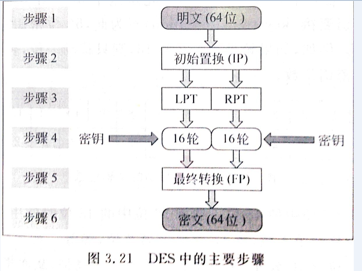

在SSL中会用到分组DES、三重DES算法等加密算法对数据进行加密。当然可以选用其他非DES加密算法，视情况而定，后面会详细介绍。

3、密钥交换算法

      使用对称加密算法时，密钥交换是个大难题，所以Diffie和Hellman提出了著名的Diffie-Hellman密钥交换算法。

     Diffie-Hellman密钥交换算法原理：

```cpp
（1）Alice与Bob确定两个大素数n和g，这两个数不用保密

（2）Alice选择另一个大随机数x，并计算A如下：A=gx mod n

（3）Alice将A发给Bob

（4）Bob  选择另一个大随机数y，并计算B如下：B=gy mod n

（5）Bob将B发给Alice

（6）计算秘密密钥K1如下：K1=Bx mod n

（7）计算秘密密钥K2如下：K2=Ay mod n

  K1=K2，因此Alice和Bob可以用其进行加解密
```

RSA加密算法是基于这样的数学事实：两个大素数相乘容易，而对得到的乘积求因子则很难。加密过程如下：

```cpp
(1)选择两个大素数P、Q
(2)计算N=P*Q
(3)选择一个公钥（加密密钥）E，使其不是(P-1)与(Q-1)的因子
(4)选择私钥（解密密钥）D，满足如下条件：
          (D*E) mod (P-1)(Q-1)=1
(5)加密时，明文PT计算密文CT如下：
          CT=PTE mod N
(6)解密时，从密文CT计算明文PT如下：
          PT=CTDmodN 这也是SSL中会用一种密钥交换算法。
```
 

3、散列算法： 

主要用于验证数据的完整性，即保证时消息在发送之后和接收之前没有被篡改对于SSL中使用到的散列算法有MD5、SHA-1。

4、数字证书：

 数字证书其实就是一个小的计算机文件，其作用类似于我们的身份证、护照，用于证明身份，在SSL中，使用数字证书来证明自己的身份，而不是伪造的。

5、简单的总结：

在SSL中会使用密钥交换算法交换密钥；使用密钥对数据进行加密；使用散列算法对数据的完整性进行验证，使用数字证书证明自己的身份。好了，下面开始介绍SSL协议。

SSL介绍：

安全套接字（Secure Socket Layer，SSL）协议是Web浏览器与Web服务器之间安全交换信息的协议，提供两个基本的安全服务：鉴别与保密。

SSL是Netscape于1994年开发的，后来成为了世界上最著名的web安全机制，所有主要的浏览器都支持SSL协议

目前有三个版本：2、3、3.1，最常用的是第3版，是1995年发布的。

SSL协议的三个特性

① 保密：在握手协议中定义了会话密钥后，所有的消息都被加密。

② 鉴别：可选的客户端认证，和强制的服务器端认证。

③ 完整性：传送的消息包括消息完整性检查（使用MAC）。

SSL的位置

SSL介于应用层和TCP层之间。应用层数据不再直接传递给传输层，而是传递给SSL层，SSL层对从应用层收到的数据进行加密，并增加自己的SSL头。

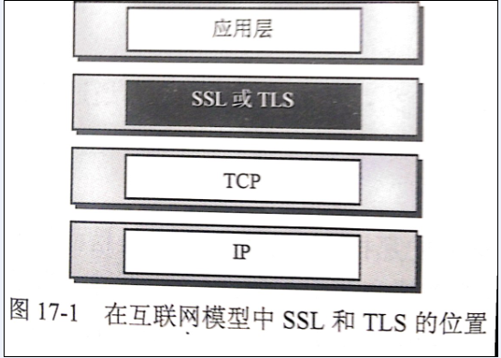

 

SSL的工作原理

握手协议（Handshake protocol）

记录协议（Record protocol）

警报协议（Alert protocol）

1、握手协议

握手协议是客户机和服务器用SSL连接通信时使用的第一个子协议，握手协议包括客户机与服务器之间的一系列消息。SSL中最复杂的协议就是握手协议。该协议允许服务器和客户机相互验证，协商加密和MAC算法以及保密密钥，用来保护在SSL记录中发送的数据。握手协议是在应用程序的数据传输之前使用的。

每个握手协议包含以下3个字段
（1）Type：表示10种消息类型之一
（2）Length：表示消息长度字节数
（3）Content：与消息相关的参数
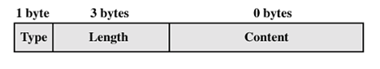


握手协议的4个阶段
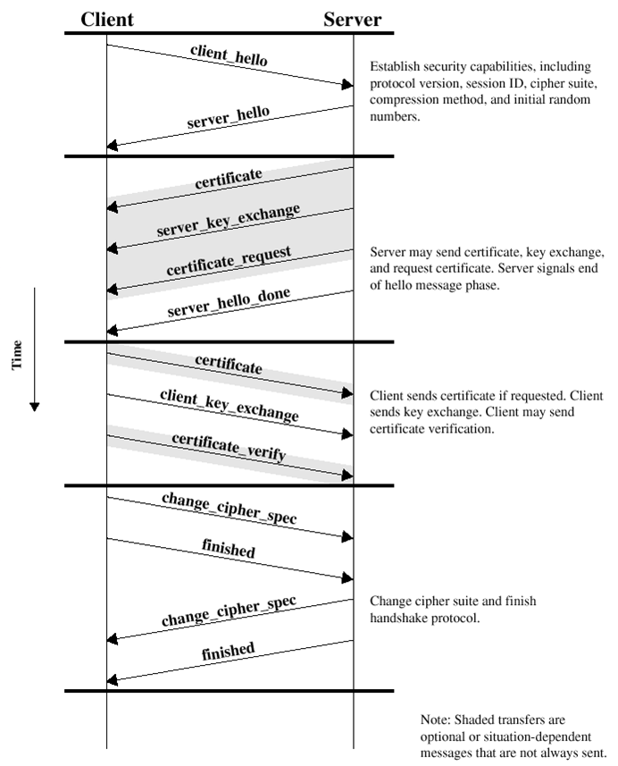


1.1建立安全能力

    SSL握手的第一阶段启动逻辑连接，建立这个连接的安全能力。首先客户机向服务器发出client hello消息并等待服务器响应，随后服务器向客户机返回server hello消息，对client hello消息中的信息进行确认。
    Client hello消息包括Version，Random，Session id，Cipher suite，Compression method等信息。
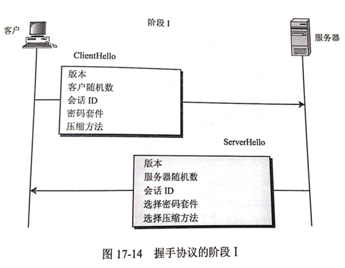


ClientHello 客户发送CilentHello信息，包含如下内容：

（1）客户端可以支持的SSL最高版本号

（2）一个用于生成主秘密的32字节的随机数。（等会介绍主秘密是什么）

（3）一个确定会话的会话ID。

（4）一个客户端可以支持的密码套件列表。

    密码套件格式：每个套件都以“SSL”开头，紧跟着的是密钥交换算法。用“With”这个词把密钥交换算法、加密算法、散列算法分开，例如：SSL_DHE_RSA_WITH_DES_CBC_SHA,表示把DHE_RSA(带有RSA数字签名的暂时Diffie-HellMan)定义为密钥交换算法；把DES_CBC定义为加密算法；把SHA定义为散列算法。

（5）一个客户端可以支持的压缩算法列表。

 ServerHello 服务器用ServerHello信息应答客户，包括下列内容

（1）一个SSL版本号。取客户端支持的最高版本号和服务端支持的最高版本号中的较低者。

（2）一个用于生成主秘密的32字节的随机数。（客户端一个、服务端一个）

（3）会话ID

（4）从客户端的密码套件列表中选择的一个密码套件

（5）从客户端的压缩方法的列表中选择的压缩方法

这个阶段之后，客户端服务端知道了下列内容：

（1）SSL版本

（2）密钥交换、信息验证和加密算法

（3）压缩方法

（4）有关密钥生成的两个随机数。

1.2 服务器鉴别与密钥交换

 服务器启动SSL握手第2阶段，是本阶段所有消息的唯一发送方，客户机是所有消息的唯一接收方。该阶段分为4步：
（a）证书：服务器将数字证书和到根CA整个链发给客户端，使客户端能用服务器证书中的服务器公钥认证服务器。
（b）服务器密钥交换（可选）：这里视密钥交换算法而定
（c）证书请求：服务端可能会要求客户自身进行验证。
（d）服务器握手完成：第二阶段的结束，第三阶段开始的信号


这里重点介绍一下服务端的验证和密钥交换。这个阶段的前面的（a）证书 和（b）服务器密钥交换是基于密钥交换方法的。而在SSL中密钥交换算法有6种：无效（没有密钥交换）、RSA、匿名Diffie-Hellman、暂时Diffie-Hellman、固定Diffie-Hellman、Fortezza。

在阶段1过程客户端与服务端协商的过程中已经确定使哪种密钥交换算法。

如果协商过程中确定使用RSA交换密钥，那么过程如下图：

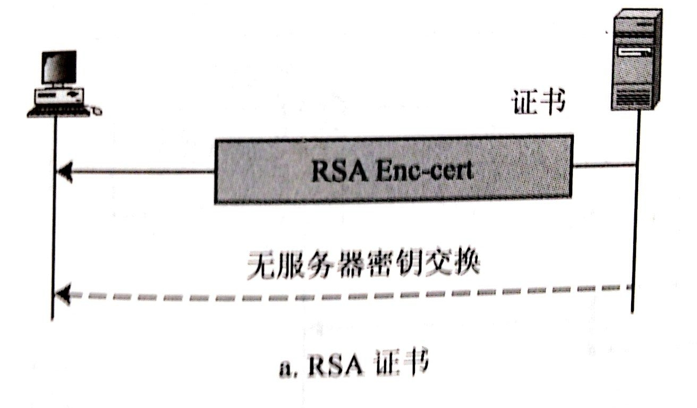

这个方法中，服务器在它的第一个信息中，发送了RSA加密/解密公钥证书。不过，因为预备主秘密是由客户端在下一个阶段生成并发送的，所以第二个信息是空的。注意，公钥证书会进行从服务器到客户端的验证。当服务器收到预备主秘密时，它使用私钥进行解密。服务端拥有私钥是一个证据，可以证明服务器是一个它在第一个信息发送的公钥证书中要求的实体。

其他的几种密钥交换算法这里就不介绍了。可以参考Behrouz A.Forouzan著的《密码学与网络安全》。

 1.3 客户机鉴别与密钥交换：

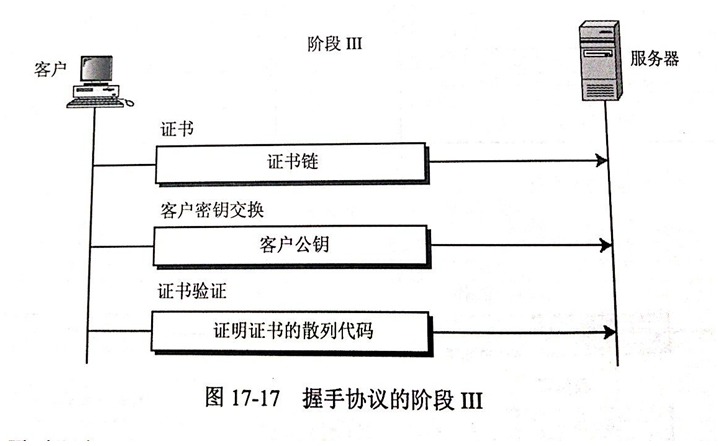

 

客户机启动SSL握手第3阶段，是本阶段所有消息的唯一发送方，服务器是所有消息的唯一接收方。该阶段分为3步：
（a）证书（可选）：为了对服务器证明自身，客户要发送一个证书信息，这是可选的，在IIS中可以配置强制客户端证书认证。
（b）客户机密钥交换（Pre-master-secret）：这里客户端将预备主密钥发送给服务端，注意这里会使用服务端的公钥进行加密。
（c）证书验证（可选），对预备秘密和随机数进行签名，证明拥有（a）证书的公钥。
下面也重点介绍一下RSA方式的客户端验证和密钥交换。
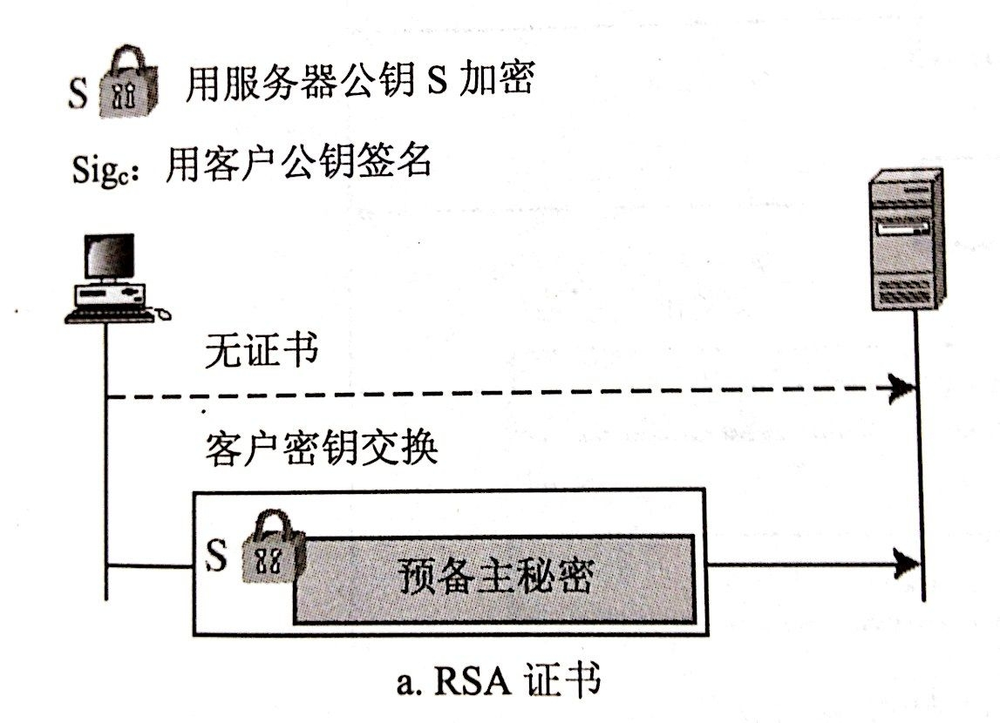

这种情况，除非服务器在阶段II明确请求，否则没有证书信息。客户端密钥交换方法包括阶段II收到的由RSA公钥加密的预备主密钥。
阶段III之后，客户要有服务器进行验证，客户和服务器都知道预备主密钥。
1.4 完成
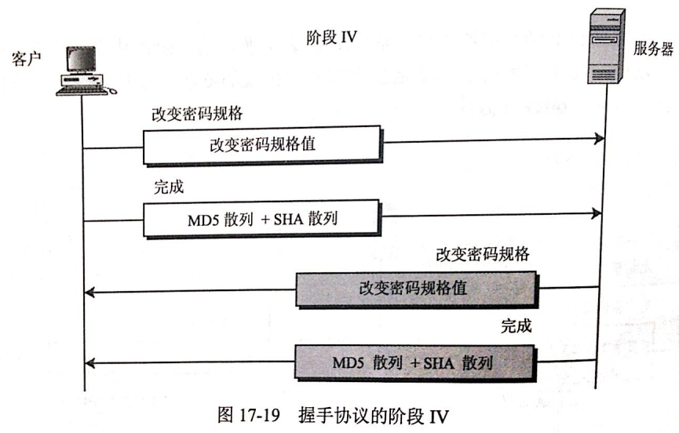


客户机启动SSL握手第4阶段，使服务器结束。该阶段分为4步，前2个消息来自客户机，后2个消息来自服务器。

1.5密钥生成的过程

这样握手协议完成，下面看下什么是预备主密钥，主密钥是怎么生成的。为了保证信息的完整性和机密性，SSL需要有六个加密秘密：四个密钥和两个IV。为了信息的可信性，客户端需要一个密钥（HMAC），为了加密要有一个密钥，为了分组加密要一个IV，服务也是如此。SSL需要的密钥是单向的，不同于那些在其他方向的密钥。如果在一个方向上有攻击，这种攻击在其他方向是没影响的。生成过程如下：

 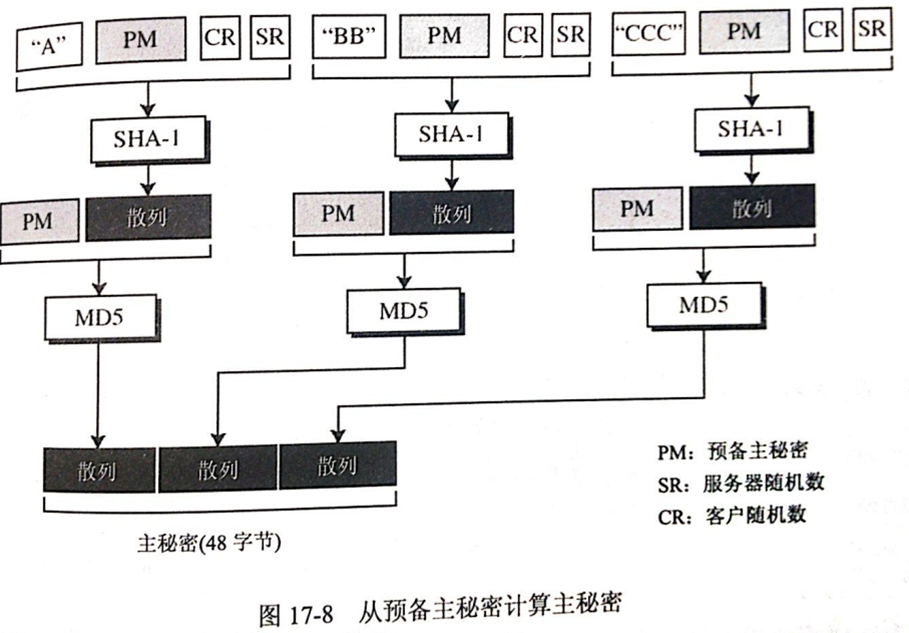
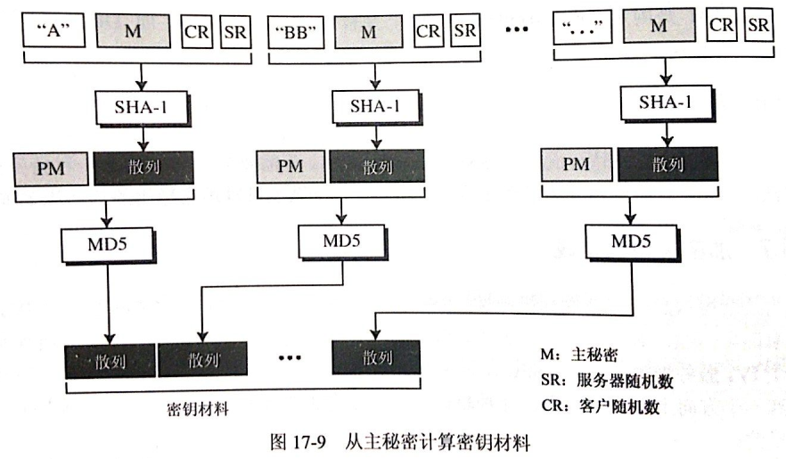
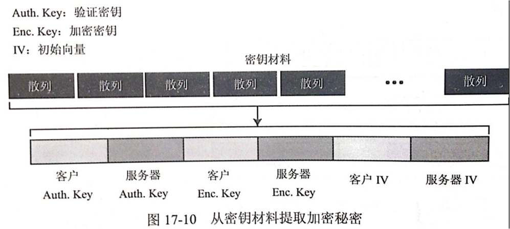
 


 


 

2、记录协议 

记录协议在客户机和服务器握手成功后使用，即客户机和服务器鉴别对方和确定安全信息交换使用的算法后，进入SSL记录协议，记录协议向SSL连接提供两个服务：
（1）保密性：使用握手协议定义的秘密密钥实现
（2）完整性：握手协议定义了MAC，用于保证消息完整性
记录协议的过程：


 3、警报协议

客户机和服务器发现错误时，向对方发送一个警报消息。如果是致命错误，则算法立即关闭SSL连接，双方还会先删除相关的会话号，秘密和密钥。每个警报消息共2个字节，第1个字节表示错误类型，如果是警报，则值为1，如果是致命错误，则值为2；第2个字节制定实际错误类型。
总结
SSL中，使用握手协议协商加密和MAC算法以及保密密钥 ，使用握手协议对交换的数据进行加密和签名，使用警报协议定义数据传输过程中，出现问题如何去解决。
整个过程比较复杂，如果大家有不理解和我叙述不周的地方，欢迎大家指正出来！
 