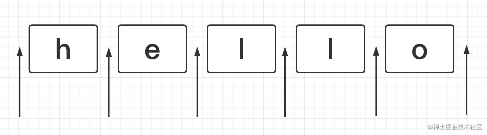
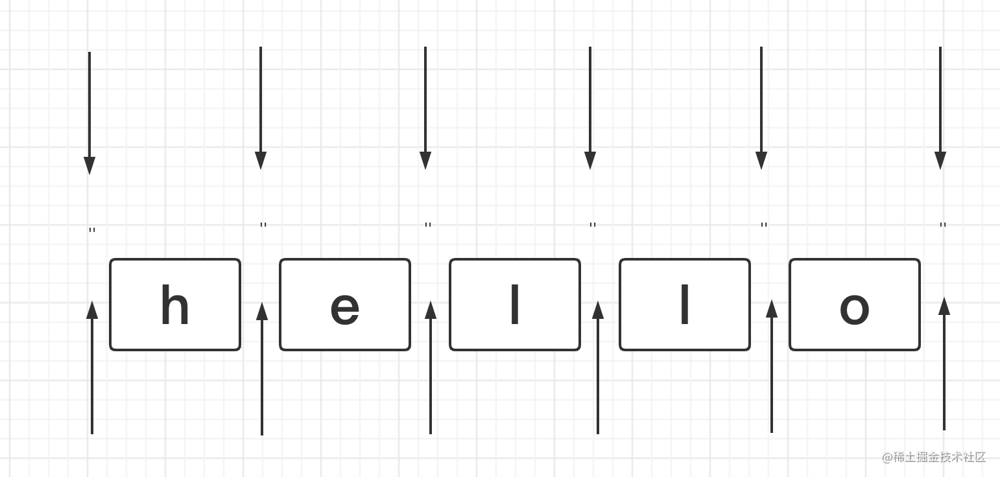
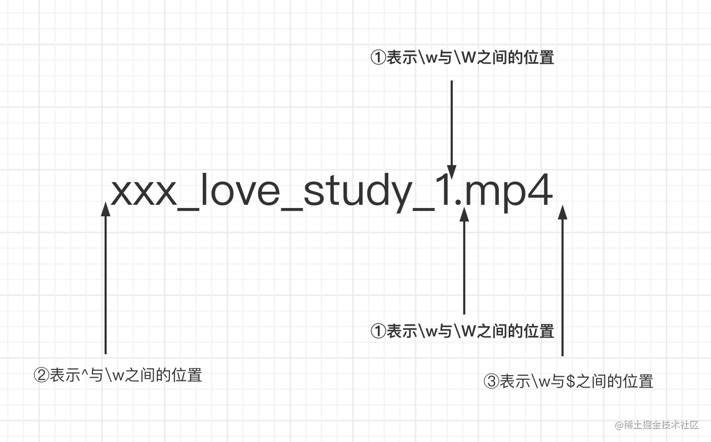
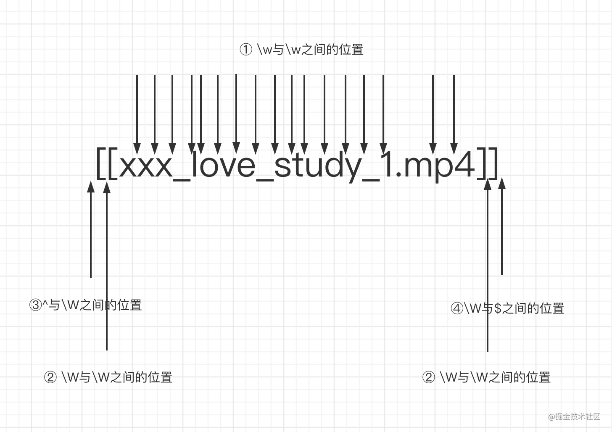
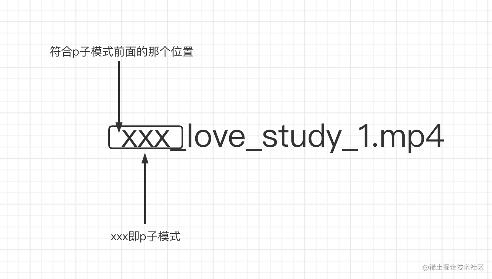
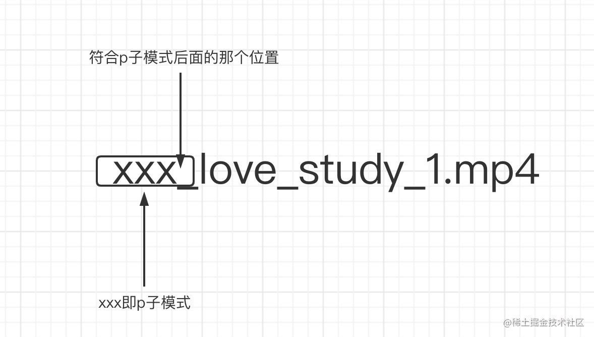

本文已参与 [「掘力星计划」](https://juejin.cn/post/7012210233804079141 "https://juejin.cn/post/7012210233804079141") ，赢取创作大礼包，挑战创作激励金。

# 讲个小笑话

> 昨天下完班，好久才回到家，就因为公司楼下的停车场设计的和迷宫一样，每次都要找好久，才能发现，`我没有车`o(╥﹏╥)o。

# 前言

> 曾经我一度对正则表达式有种恐惧和厌恶感，为啥？因为总感觉这玩意很难，很枯燥，看到别人写出`贼牛逼的正则`，我想啥时候我能像他们一样优秀。直到我看到了这三个知识点。。。


只需要花**10分钟**时间，你可以收获

1. 正则表达式中的**位置匹配原理与知识**
2. 正则表达式中的**字符串匹配原理与知识**
3. 正则表达式中的**括号的妙用**
4. 14个常见正则表达式解析帮助理解知识点

**相信我，看完这篇文章，对于工作中90%以上的正则问题你都能找到解决思路和方案。**

**相信我，看完这篇文章，对于工作中90%以上的正则问题你都能找到解决思路和方案。**

**相信我，看完这篇文章，对于工作中90%以上的正则问题你都能找到解决思路和方案。**

# 默念三声

正则表达式是`匹配模式`，要么`匹配字符`，要么`匹配位置`

正则表达式是`匹配模式`，要么`匹配字符`，要么`匹配位置`

正则表达式是`匹配模式`，要么`匹配字符`，要么`匹配位置`

# 1.搞懂位置能干啥？


题目1：数字的千分位分割法

> 将123456789转化为123,456,789


题目2：手机号3-4-4分割

> 将手机号18379836654转化为183-7983-6654


题目3：验证密码的合法性

> 密码长度是6-12位，由数字、小写字符和大写字母组成，但必须至少包括2种字符


这些题时常出现在面试中，日常业务也少不了它的身影。**搞懂位置，不仅能搞定面试，业务你也将写的飞起**

## 啥是位置？

正则表达式是匹配模式，要么匹配字符，要么匹配位置。那什么是**位置**呢?

如下图箭头所指，位置可以理解为**相邻字符之间的位置**。



咱们可以和**空字符串**进行类比, 字符的首尾、间隙都可以用空字符串进行连接。

``` javascript
'hello' === '' + 'h' + '' + 'e' + '' + 'l' + '' +  'l' + '' + 'o' + '' // true

```



## 有哪些位置？

正则中常用来表示位置的符号主要有：

 ^、$、\b、\B、?=p、(?!p)、(?<=p)、(?<!p)
 
 接下来咱们就一个个把他们全整明白。


### ^

> 脱字符，匹配行的开头

例如要在hello的开头塞一个笑脸(😄 )怎么搞,这个肯定难不倒你

``` javascript

let string = 'hello'

console.log(string.replace(/^/, '😄')) // 😄hello


```

### $

> 美元符号，匹配行的结尾

同理想在hello的结尾塞一个笑脸(😄 )呢？

``` javascript

let string = 'hello'

console.log(string.replace(/$/, '😄')) // hello😄


```
这两个表示首尾位置的符号，相信大家一定都很熟悉。

### \b

> 单词的边界，具体讲有三点规则。

① \w和\W之间的位置

②  ^与\w之间的位置 

③ \w与$之间的位置

比如藏在你们电脑上`学习教程`文件夹中的某一集种子长这样**xxx_love_study_1.mp4**，想要把他变成`❤️xxx_love_study_1❤️.❤️mp4❤️`怎么搞呢？


其实只需要执行一行代码就行

``` javascript

'xxx_love_study_1.mp4'.replace(/\b/g, '❤️') // ❤️xxx_love_study_1❤️.❤️mp4❤️

```

画图理解就是




### \B

> 非单词的边界，也就是\b反着来的意思，它的规则如下：

① \w与\w之间的位置

② \W与\W之间的位置

③^与\W之间的位置

④\W与$之间的位置

同样还是用`学习教程`文件夹中的种子，稍稍改造一下，当执行这行代码之后，会输出啥？

``` javascript
'[[xxx_love_study_1.mp4]]'.replace(/\B/g, '❤️')

```

....

没错，满满的都是爱啊！！！，都快看不清名字了。

``` javascript

❤️[❤️[x❤️x❤️x❤️_❤️l❤️o❤️v❤️e❤️_❤️s❤️t❤️u❤️d❤️y❤️_❤️1.m❤️p❤️4]❤️]❤️

``` 

画图解释如下



### (?=p)

> 符合p子模式前面的那个位置。换句话说是，有一个位置，紧跟其后需要满足p子模式。也有一个学名叫正向先行断言。

还是这个例子`xxx_love_study_1.mp4`，要在xxx(xxx可以指代任何你喜欢的那个TA)前面塞一个❤️,怎么写呢？

是这样吗？ 不是的，这样会导致你的xxx都不见了，那还要❤️做什么呢？

``` javascript

'xxx_love_study_1.mp4'.replace('xxx', '❤️') // ❤️_love_study_1.mp4


```

利用(?=p)就可以很方便这这件事（可以想想和上面有什么不同？）

``` javascript

'xxx_love_study_1.mp4'.replace(/(?=xxx)/g, '❤️') // ❤️xxx_love_study_1.mp4


```

画图理解




### (?!p)

> (?=p)反过来的意思，可以理解为(?=p)匹配到的位置之外的位置都是属于(?!p)的，它也有一个学名叫负向先行断言。


``` javascript

'xxx_love_study_1.mp4'.replace(/(?!xxx)/g, '❤️') 

// (?=xxx)的输出
❤️xxx_love_study_1.mp4
// (?!xxx)的输出
x❤️x❤️x❤️_❤️l❤️o❤️v❤️e❤️_❤️s❤️t❤️u❤️d❤️y❤️_❤️1❤️.❤️m❤️p❤️4❤️

```

仔细对比一下，是不是除了(?=xxx)匹配到最前面那个位置，其他位置都是(?!xxx)匹配到的啦。


### (?<=p)

> 符合p子模式后面(注意(?=p)表示的是前面)的那个位置。换句话说是，有一个位置，其前面的部分需要满足p子模式。

依然是这个例子：我们要在xxx(xxx可以指代任何你喜欢的那个TA)的后面塞一个❤️,怎么写呢？

``` javascript
'xxx_love_study_1.mp4'.replace(/(?<=xxx)/g, '❤️') //xxx❤️_love_study_1.mp4


```

画图解释





### (?<!p)
> (?<=p)反过来的意思，可以理解为(?<=p)匹配到的位置之外的位置都是属于(?<!p)的，

``` javascript

'xxx_love_study_1.mp4'.replace(/(?<!xxx)/g, '❤️') 

// (?<=xxx)的输出
xxx❤️_love_study_1.mp4
// (?<!xxx)的输出
❤️x❤️x❤️x_❤️l❤️o❤️v❤️e❤️_❤️s❤️t❤️u❤️d❤️y❤️_❤️1❤️.❤️m❤️p❤️4❤️

```

仔细对比一下，是不是除了(?<=xxx)匹配到后面那个位置，其他位置都是(?<!xxx)匹配到的啦。


## 栗子详解

> 学习完位置相关的知识，我们来做一下开头的几个题目试试

### 题目1：数字的千分位分割法

> 将123456789转化为123,456,789

观察题目的规律就是从后往前，每三个数字前加一个逗号，`（需要注意的是开头不需要加逗号，）`。是不是很符合
(?=p)的规律呢？p可以表示每三个数字，要添加的逗号所处的位置正好是(?=p)匹配出来的位置。


**第一步，尝试先把后面第一个逗号弄出来**

``` javascript


let price = '123456789'
let priceReg = /(?=\d{3}$)/

console.log(price.replace(priceReg, ',')) // 123456,789


```

**第二步，把所有的逗号都弄出来**

要把所有的逗号都弄出来，主要要解决的问题是怎么表示`三个数字一组`,也就是3的倍数。我们知道正则中括号可以把一个p模式变成一个小整体，所以利用括号的性质，可以这样写

``` javascript


let price = '123456789'
let priceReg = /(?=(\d{3})+$)/g

console.log(price.replace(priceReg, ',')) // ,123,456,789

```

**第三步，去掉首位的逗号，**

上面已经基本上实现需求了，但是还不够，首位会出现,那怎么把首位的逗号去除呢？想想前面是不是有一个知识正好满足这个场景？ 没错(?!p)，就是他了，两者结合就是从后往前每三个数字的位置前添加逗号，但是这个位置不能是^首位。


``` javascript

let price = '123456789'
let priceReg = /(?!^)(?=(\d{3})+$)/g

console.log(price.replace(priceReg, ',')) // 123,456,789
```


### 题目2：手机号3-4-4分割

> 将手机号18379836654转化为183-7983-6654

有了上面数字的千分位分割法，做这个题相信会简单很多，也就是从后往前找到这样的位置：

每四个数字前的位置，并把这个位置替换为-

``` javascript

let mobile = '18379836654'
let mobileReg = /(?=(\d{4})+$)/g

console.log(mobile.replace(mobileReg, '-')) // 183-7983-6654

```


### 题目3：手机号3-4-4分割扩展

> 将手机号11位以内的数字转化为3-4-4格式

回想一下这样的场景，有一个表单需要收集用户的手机号，用户是一个个数字输入的，我们需要在用户输入11位手机号的过程中把其转化为3-3-4格式。即

``` javascript
123 => 123
1234 => 123-4
12345 => 123-45
123456 => 123-456
1234567 => 123-4567
12345678 => 123-4567-8
123456789 => 123-4567-89
12345678911 => 123-4567-8911

```

这样用(?=p)就不太合适了，例如1234就会变成-1234。
想想前面的知识点有适合处理这种场景的吗？是的(?<=p)

**第一步, 将第一个-弄出来**

``` javascript
const formatMobile = (mobile) => {
  return String(mobile).replace(/(?<=\d{3})\d+/, '-')      
}

console.log(formatMobile(123)) // 123
console.log(formatMobile(1234)) // 123-

```

**将第二个-弄出来**

将第一个-弄出来之后，字符的长度多了一位，原本1234567(这个位置插入-)8，要变成往后移一位

``` javascript
const formatMobile = (mobile) => {
  return String(mobile).slice(0,11)
      .replace(/(?<=\d{3})\d+/, ($0) => '-' + $0)
      .replace(/(?<=[\d-]{8})\d{1,4}/, ($0) => '-' + $0)
}

console.log(formatMobile(123)) // 123
console.log(formatMobile(1234)) // 123-4
console.log(formatMobile(12345)) // 123-45
console.log(formatMobile(123456)) // 123-456
console.log(formatMobile(1234567)) // 123-4567
console.log(formatMobile(12345678)) // 123-4567-8
console.log(formatMobile(123456789)) // 123-4567-89
console.log(formatMobile(12345678911)) // 123-4567-8911

```


### 题目4：验证密码的合法性

> 密码长度是6-12位，由数字、小写字符和大写字母组成，但必须至少包括2种字符

题目由三个条件组成

① 密码长度是6-12位

② 由数字、小写字符和大写字母组成

③ 必须至少包括2种字符

**第一步写出条件①和②和正则**

``` javascripot
let reg = /^[a-zA-Z\d]{6,12}$/

```

**第二步，必须包含某种字符（数字、小写字母、大写字母）**

```javascripot
let reg = /(?=.*\d)/
// 这个正则的意思是，匹配的是一个位置，这个位置需要满足`任意数量的符号，紧跟着是个数字`，注意它最终得到的是个位置，而不是数字或者是数字前面有任意的东西

console.log(reg.test('hello')) // false
console.log(reg.test('hello1')) // true
console.log(reg.test('hel2lo')) // true

// 其他类型同理

```

**第三步，写出完整的正则**

必须包含两种字符，有下面四种排列组合方式

① 数字和小写字母组合

② 数字和大写字母组合

③ 小写字母与大写字母组合

④ 数字、小写字母、大写字母一起组合（但其实前面三种已经覆盖了第四种了）


``` javascripot
// 表示条件①和②
// let reg = /((?=.*\d)((?=.*[a-z])|(?=.*[A-Z])))/
// 表示条件条件③
// let reg = /(?=.*[a-z])(?=.*[A-Z])/
// 表示条件①②③
// let reg = /((?=.*\d)((?=.*[a-z])|(?=.*[A-Z])))|(?=.*[a-z])(?=.*[A-Z])/
// 表示题目所有条件
let reg = /((?=.*\d)((?=.*[a-z])|(?=.*[A-Z])))|(?=.*[a-z])(?=.*[A-Z])^[a-zA-Z\d]{6,12}$/


console.log(reg.test('123456')) // false
console.log(reg.test('aaaaaa')) // false
console.log(reg.test('AAAAAAA')) // false
console.log(reg.test('1a1a1a')) // true
console.log(reg.test('1A1A1A')) // true
console.log(reg.test('aAaAaA')) // true
console.log(reg.test('1aA1aA1aA')) // true

```

# 2. 字符串匹配原来这么简单

## 两种模糊匹配

正则如果只有精确匹配，那么便完全没有了意义

### 横向

> 一个正则可匹配的字符串的长度不是固定的，可以是多种情况，通过量词+、*、?、{m,n}，可实现横向匹配

``` javascript
let reg = /ab{2,5}c/g
let str = 'abc abbc abbbc abbbbc abbbbbc abbbbbbc'

str.match(reg) // [ 'abbc', 'abbbc', 'abbbbc', 'abbbbbc' ]
```

### 纵向

> 一个正则匹配的字符串，具体到某一位字符时，可以不是某个确定的字符串，可以有多种可能，实现方式是字符组( 其实多选分支|也可以实现 )

```javascript
let reg = /a[123]b/g
let str = 'a0b a1b a2b a3b a4b'

str.match(reg) // [ 'a1b', 'a2b', 'a3b' ]
```

## 字符组

> 不要被名字给糊弄了，虽然他叫做字符组，但其实只是代表一个字符的可能性

### 范围表示法

```javascript
[123456abcdefABCDEF] => [1-6a-fA-F]
```

### 排除字符组

> 某位字符可以是任何东西，但是就是不能是xxx, 使用^符号

问题：如何要表示除了某个单词之外的任意东西呢？

```javascript
[^abc]
```

### 常见简写形式

```javascript
\d // 数字
\D // 非数字
\w // [0-9a-zA-Z_]
\W // [^0-9a-zA-Z_]
\s // [\t\v\n\r\f]
\S // [^\t\v\n\r\f]
.
```

## 量词

### 量词 & 简写

```javascript
1. {m,} // 至少出现m次
2. {m} // 出现m次
3. ? // 出现0次或者1次，等价于{0,1}    
4. + // 至少出现1次,等价于{1,} 
5. * // 出现人一次,等价于{0,}  
```

### 贪婪匹配 VS 惰性匹配

> 正则本身是贪婪的，会尽可能的多匹配符合模式的字符

```javascript
let regex = /\d{2,5}/g
let string = '123 1234 12345 123456'
// 贪婪匹配
// string.match(regex) // [ 123, 1234, 12345, 12345 ]

// 惰性匹配
let regex2 = /\d{2,5}?/g
// string.match(regex) // [ 12, 12, 34, 12, 34, 12, 34, 56  ]
```

量词后面加一个？，即变成了惰性匹配

```javascript
贪婪量词        惰性量词
{m,n}            {m,n}?
{m,}             {m,}?
?                       ??
+                       +?
*                   *?  
```

## 多选分支

一个模式可以实现横向和纵向的模糊匹配，而多选分支可以支持多个子模式任选其一，形式是(p1|p2|p3)

```javascript
let regex = /good|nice/g
let string = 'good idea, nice try.'

// string.match(regex) // [ 'good', 'nice' ]

// 注意，用/good|goodbye/去匹配'goodbye' 匹配到的是good
// 因为分支结构是惰性的，前面的匹配上了，后面的就不再尝试了
```

## 案例分析

### 1.匹配id

```javascript
// 1
let regex = /id=".*?"/ // 想想为什么要加? 不加的话 连后面的class都会匹配到
let string = '<div id="container" class="main"></div>';
console.log(string.match(regex)[0]);
// 2
let regex = /id="[^"]*"/ 
let string = '<div id="container" class="main"></div>'; 
console.log(string.match(regex)[0]); 
```

### 2.匹配16进制的颜色值

```javascript
// 要求匹配如下颜色
/*
#ffbbad
#Fc01DF
#FFF
#ffE
*/

let regex = /#([a-fA-F\d]{6}|[a-fA-F\d]{3})/g
let string = "#ffbbad #Fc01DF #FFF #ffE";

console.log(string.match(regex))
//  ["#ffbbad", "#Fc01DF", "#FFF", "#ffE"]
```

### 3.匹配24小时制时间

```javascript
/*
    要求匹配
  23:59
  02:07
*/
// 解析：
// 第一位：可以是0、1、2
// 第二位：当第一位位0或者1的时候，可以是0到9、第一位是2的时候，只可以是0到3
// 第三位：固定是冒号：
// 第四位：可以是0到5
// 第五位：0到9

let regex = /^([01]\d|2[0-3]):[0-5]\d$/

console.log(regex.test('23:59')) // true
console.log(regex.test('02:07'))// true

// 衍生题，可以是非0
let regex = /^(0?\d|1\d|2[0-3]):(0?|[1-5])\d/

console.log( regex.test("23:59") ) // true
console.log( regex.test("02:07") ) // true
console.log( regex.test("7:09") ) // true
```

### 4.匹配日期

```javascript
/*
    要求匹配
  yyyy-mm-dd格式的日期
  注意月份、和日的匹配
*/

let regex = /\d{4}-(0\d|1[0-2])-(0[1-9]|[12]\d|3[01])/

console.log( regex.test("2017-06-10") ) // true
console.log( regex.test("2017-11-10") ) // true
```


# 3. 括号的神奇作用

> 括号的作用是提供了分组(括号内的正则是一个整体，即提供子表达式)，便于我们引用它

### 分组

如何让量词作用于一个整体？

```javascript
let reg = /(ab)+/g
let string = 'ababa abbb ababab'

console.log(string.match(reg)) // ["abab", "ab", "ababab"]
```

### 分支结构

分支结构有点像编程里面或的概念||

```javascript
/*
匹配 
I love JavaScript
I love Regular Expression
*/

let reg = /I love (JavaScript|Regular Expression)/

console.log(reg.test('I love JavaScript')) // true
console.log(reg.test('I love Regular Expression')) // true
```

## 分组引用

通过括号创建子表达式，可以进行数据提取和强大的替换操作，也可以通过js来引用分组内容

### 提取数据

```javascript
/*
提取年月日
2021-08-14
*/

let reg = /(\d{4})-(\d{2})-(\d{2})/

console.log('2021-08-14'.match(reg))
//  ["2021-08-14", "2021", "08", "14", index: 0, input: "2021-08-14", groups: undefined]

// 第二种解法,通过全局的$1...$9读取 引用的括号数据
let reg = /(\d{4})-(\d{2})-(\d{2})/
let string = '2021-08-14'

reg.test(string)

console.log(RegExp.$1) // 2021
console.log(RegExp.$2) // 08
console.log(RegExp.$3) // 14
```

### 数据替换

```javascript
/*
将以下格式替换为mm/dd/yyy
2021-08-14
*/
// 第一种解法
let reg = /(\d{4})-(\d{2})-(\d{2})/
let string = '2021-08-14'
// 第一种写法
let result1 = string.replace(reg, '$2/$3/$1')
console.log(result1) // 08/14/2021
// 第二种写法
let result2 = string.replace(reg, () => {
    return RegExp.$2 + '/' + RegExp.$3 + '/' + RegExp.$1
})
console.log(result2) // 08/14/2021
// 第三种写法
let result3 = string.replace(reg, ($0, $1, $2, $3) => {
    return $2 + '/' + $3 + '/' + $1
})
console.log(result3) // 08/14/2021
```

## 反向引用（很重要）

除了通过js引用分组的内容，也可以通过正则来引用分组内容

```javascript
/*
    写一个正则支持以下三种格式
  2016-06-12
  2016/06/12
  2016.06-12
*/
let regex = /(\d{4})([-/.])\d{2}\2\d{2}/

var string1 = "2017-06-12";
var string2 = "2017/06/12";
var string3 = "2017.06.12";
var string4 = "2016-06/12";

console.log( regex.test(string1) ); // true
console.log( regex.test(string2) ); // true
console.log( regex.test(string3) ); // true
console.log( regex.test(string4) ); // false
```

### 注意

1.  引用不存在的分组会怎样？

    1.  即匹配的就是\1 \2本身

1.  分组后面有量词会怎样？

    1.  分组后面如果有量词，分组最终(注意是分组，不是说整体)捕获的数据是最后一次的匹配

```
'12345'.match(/(\d)+/) // ["12345", "5", index: 0, input: "12345", groups: undefined]

/(\d)+ \1/.test('12345 1') // false
/(\d)+ \1/.test('12345 5') // true
```

## 非捕获性括号

上面使用的括号都会匹配他们匹配到的数据，以便后续引用，所以也可以称为捕获型分组和捕获型分支。

如果想要括号最原始的功能，但不会引用它，也就是既不会出现在API引用里，也不会出现在正则引用里，可以使用

非捕获性括号（?:p）

```javascript
// 非捕获型引用
let reg = /(?:ab)+/g
console.log('ababa abbb ababab'.match(reg)) // ["abab", "ab", "ababab"]
// 注意这里，因为是非捕获型分组，所以使用match方法时，不会出现在数组的1位置了
let reg = /(?:ab)+/
console.log('ababa abbb ababab'.match(reg)) // ["abab", index: 0, input: "ababa abbb ababab", groups: undefined]
let reg = /(ab)+/
console.log('ababa abbb ababab'.match(reg)) // ["abab", "ab", index: 0, input: "ababa abbb ababab", groups: undefined]
```

## 案例

### 1.trim方法模拟

```javascript
// 1. 提取中间关键字符, 使用的分组引用
const trim1 = (str) => {
  return str.replace(/^\s*(.*?)\s*$/, '$1')
}
// 2. 去掉开头和结尾的空字符
const trim2 = (str) => {
    return str.replace(/^\s*|\s*$/g, '')
}
```

### 2.将每个单词的首字母大写

关键是要找到每个单词的首字母

```javascript
// my name is epeli

const titleize = (str) => {
  return str.toLowerCase().replace(/(?:^|\s)\w/g, (c) => c.toUpperCase())
}  

console.log(titleize('my name is epeli')) // My Name Is Epeli

// 拓展，横向转驼峰，例如base-act-tab => BaseActTab
'base-act-tab'.replace(/(?:^|-)(\w)/g, ($0, $1) => $1.toUpperCase()) // BaseActTab
```

### 3.驼峰化

```javascript
// -moz-transform => MozTransform
const camelize = (str) => {
    return str.replace(/[-_\s]+(\w)/g, (_, $1) => $1.toUpperCase())     
}

console.log(camelize('-moz-transform')) // MozTransform
```

### 4.中划线化

```javascript
// MozTransform => -moz-transform
const dasherize = (str) => {
    return str.replace(/[A-Z]/g, ($0) => ('-' + $0).toLowerCase())
}

console.log(dasherize('MozTransform')) // -moz-transform
```

### 5.HTML转义和反转义

```javascript
// html转义规则见https://blog.wpjam.com/m/character-entity/

const escapeHTML = (str) => {
    const escapeChars = {
    '<': 'lt',
    '>': 'gt',
    '"': 'quot',
    ''': '#39',
    '&': 'amp'
  }
  
  let regexp = new RegExp(`[${Object.keys(escapeChars).join('')}]`, 'g') // 为了得到字符组[<>"'&]
    
    return str.replace(regexp, (c) => `&${escapeChars[ c ]};`)
}

console.log( escapeHTML('<div>Blah blah blah</div>')) // &lt;div&gt;Blah blah blah&lt;/div&gt;


// 反转义
const unescapseHTML = (str) => {
    const htmlEntities = {
    nbsp: ' ',
    lt: '<',
    gt: '>',
    quot: '"',
    amp: '&',
    apos: '''
  }
  
  return str.replace(/&([^;]+);/g, ($0, $1) => {
        return htmlEntities[ $1 ] || ''
    })
}

console.log(unescapseHTML('&lt;div&gt;Blah blah blah&lt;/div&gt;')) // <div>Blah blah blah</div>
```

### 6.匹配成对的标签

```javascript
/*
    匹配
      <title>regular expression</title>
        <p>laoyao bye bye</p>
  不匹配
    <title>wrong!</p>
*/
let reg = /<([^>]+)>.*?</\1>/g

console.log(reg.test('<title>regular expression</title>')) // true
console.log(reg.test('<p>laoyao bye bye</div>')) // false
```

## 相约再见

> 强烈推荐**老姚**的[正则表达式迷你小书](https://github.com/qdlaoyao/js-regex-mini-book/blob/master/JavaScript%E6%AD%A3%E5%88%99%E8%A1%A8%E8%BE%BE%E5%BC%8F%E8%BF%B7%E4%BD%A0%E4%B9%A6%EF%BC%881.1%E7%89%88%EF%BC%89.pdf)，笔者也是读了这本书之后慢慢开始对正则有些理解，不再抗拒它，这篇文章主要也是基于这本书的内容做了总结。

「欢迎在评论区讨论，掘金官方将在[掘力星计划](https://juejin.cn/post/7012210233804079141 "https://juejin.cn/post/7012210233804079141")活动结束后，在评论区抽送100份掘金周边，抽奖详情见活动文章」


## 参考
1. [ JS正则表达式完整教程（略长）](https://juejin.cn/post/6844903487155732494)
2. [三十分钟包会——正则表达式](https://juejin.cn/post/6939854031787393031#heading-4)
3. [聊聊让人头疼的正则表达式](https://juejin.cn/post/6993898348168085534#comment)


