# [驱动程序进行微软签名](https://blog.virbox.com/?p=87)

# 驱动程序进行微软签名的操作步骤

## 先了解下Windows HLK
微软新出了Windows 10 操作系统后，推出了Windows 硬件兼容性计划。而 Windows Hardware Lab Kit (Windows HLK) 是一个测试框架，用于测试 Windows 10 以及从 Windows Server 2016 开始的所有 Windows Server 版本的硬件设备。微软的官方描述如下：

“Windows Hardware Lab Kit (Windows HLK) 是一个测试框架，用于测试 Windows 10 以及从 Windows Server 2016 开始的所有 Windows Server 版本的硬件设备。 你的产品必须通过使用 Windows HLK 进行的某些测试，才有资格加入 Windows 硬件兼容性计划。”

简单来说就是，我们的驱动程序想要在 Windows 10 操作系统（某特定版本以后的版本）上加载，必须要加入 Windows 硬件兼容计划。

本文档介绍了如何构建测试环境，如何实现驱动程序的测试，以及如何创建 Windows 硬件兼容性计划 提交包等内容。Windows Hardware Lab Kit 中包含的测试，并说明了如何构建测试环境、如何实现驱动程序和系统测试的自动化，以及如何创建参与 [Windows 硬件兼容性计划](https://docs.microsoft.com/en-us/windows-hardware/design/compatibility/)所需的提交包。

微软官方描述文档：

[https://docs.microsoft.com/zh-cn/windows-hardware/test/hlk/]()

## 要求
EV证书，进行Windows驱动中心账户申请，对驱动程序、HLK测试结果进行数字签名。
HLK测试环境，HLK测试服务器，需要安装Windows HLK 控制器和 Windows HLK Studio（下载链接参考微软官方描述文档）；测试系统，根据驱动程序配置 32bit 和 64bit 操作系统
成为 Windows 开发者，注册链接：[https://developer.microsoft.com/en-us/dashboard/hardware/Driver/]()
### 步骤
下面以我司软锁驱动测试和签名的过程为例，详细讲解一下加入 Windows 硬件兼容性计划 的操作步骤。

### 驱动测试流程
第一步，找三台计算机作为签名测试机器，因为我们的驱动分64和32位版本，所以需要一台服务器，一台64位系统（下称“64位机”），一台32位系统（下称“32位机”）。

第二步，将编译好的驱动文件分别对应拷贝到32位机和64位机上，注意驱动文件必须带inf文件，使用DriverLdr.exe（这是我们内部开发的一款加载驱动的软件）在这两台电脑上加载驱动。将签名锁（即EV证书所在的UKEY）插在服务器机器上，文件签名时会用到。

第三步，在服务器机器上打开HLK Studio工程，创建一个project。如下图所示。
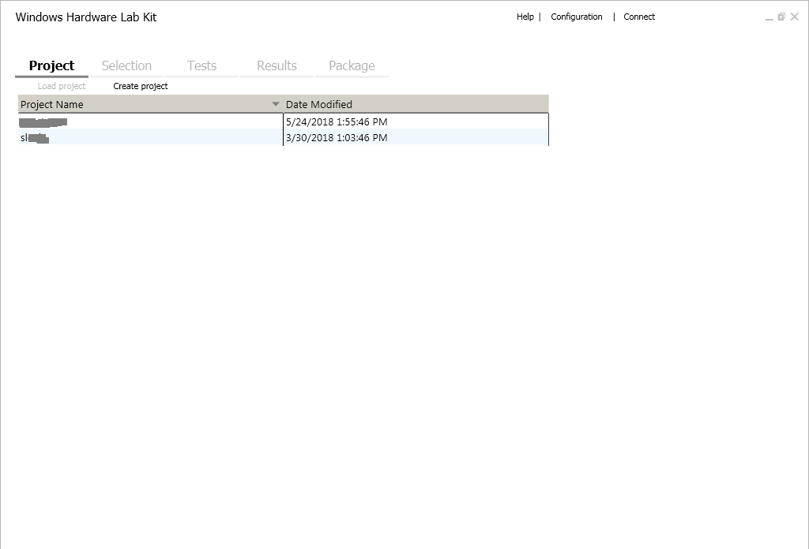

第四步，切换到Selection标签下，左上角下拉框选择【x86_x64】，左侧边栏选择【software driver】，搜索我们的驱动文件名称，然后就可以查看到我们在32位机和64位机上加载的两个驱动，勾选这两个驱动。如下图所示。
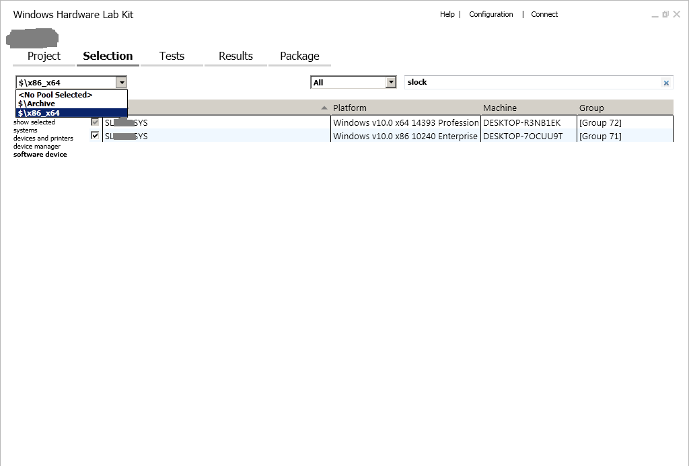

第五步，测试，切换到Tests标签下，勾选HyperVisor Code Integrity …… 然后左上角点击【Run Selected】，等待测试结果，大约需要半小时。
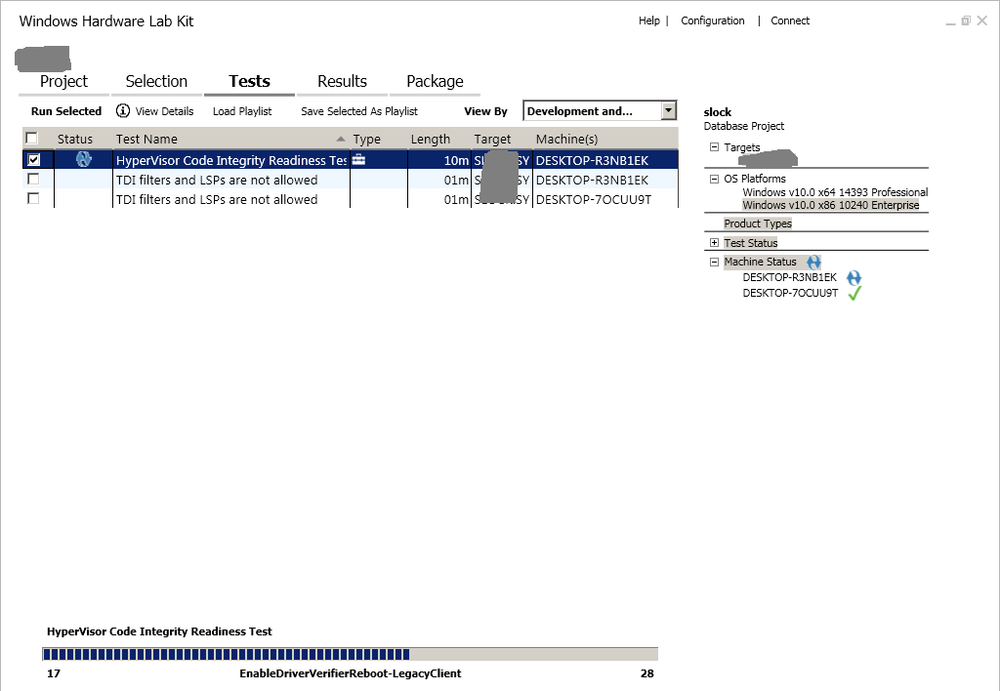

第六步，测试成功后，需要进行打包，切换到Package标签下，通过【Add Driver Folder】选择驱动文件所在的文件夹，在弹出的属性中选择驱动对应的版本，【Locales】下选全选，然后点击右下方的【Create Package】进行打包。如下图所示。
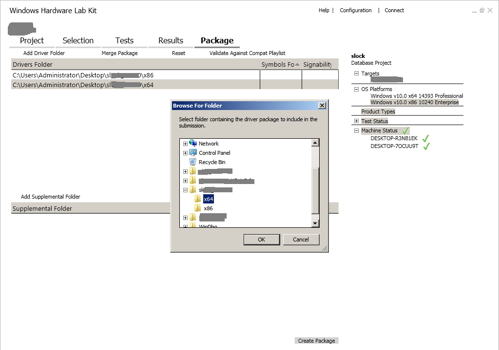
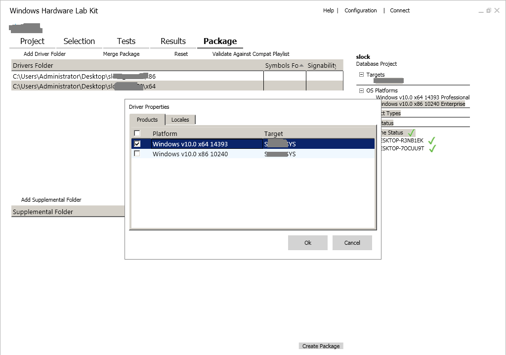
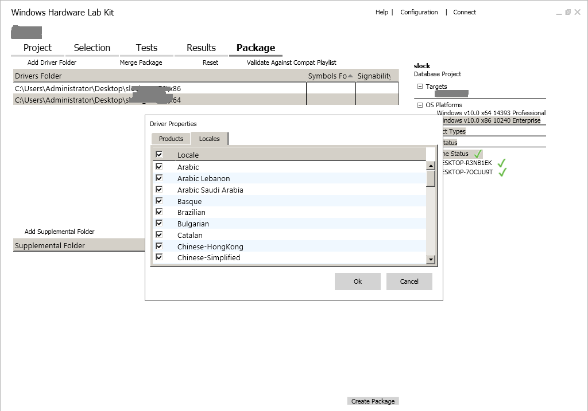

第七步，此时会弹出签名方法，选择中间的【Use the certificate store】。然后选择【EV代码签名证书】进行签名（这也是签名锁插在服务器端的原因），需要有密码。如下图所示。

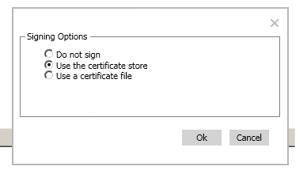
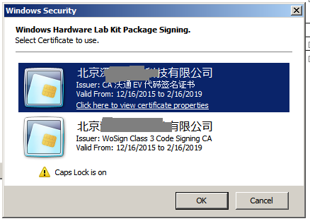

第八步，文件打包后会生成一个以.hlkx结尾的文件，注意这个文件不能直接上传微软验证，需要将其后缀改为.zip然后解压重新使用windows的zip工具压缩，再修改文件结尾为.hlkx后，再提交微软审核（具体原因不确定）。

## 提交微软审核
第一步

登录微软在线账户，网址：

https://developer.microsoft.com/en-us/dashboard/hardware/Driver/

输入账户名密码登录。
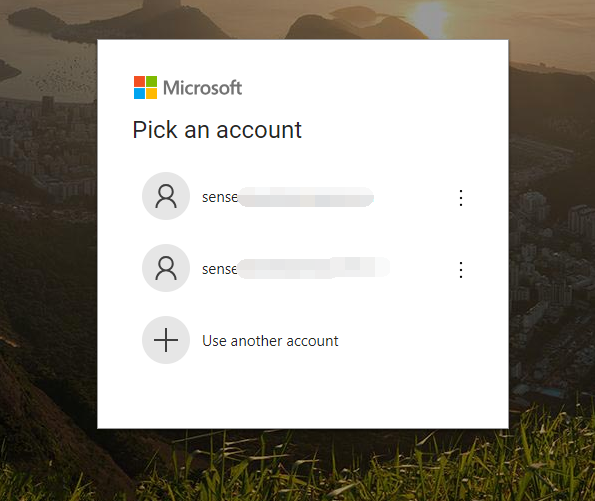
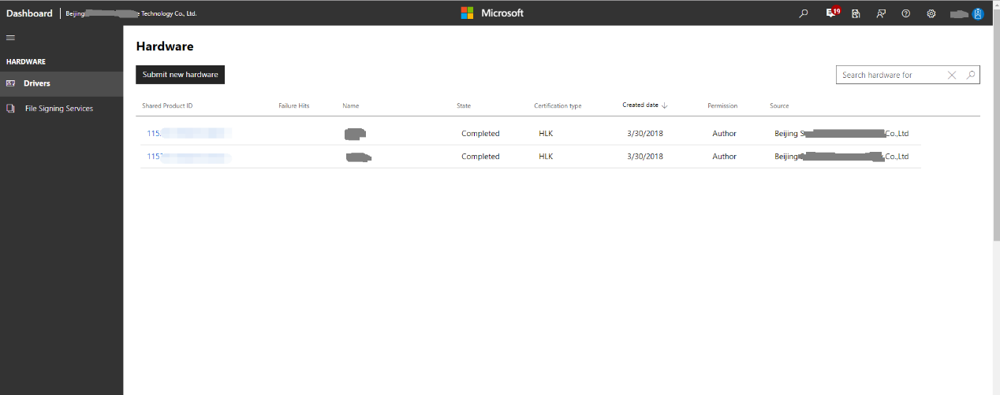

第二步，点击【Submit new hardware】，创建一个项目名称，然后添加已经打包好的测试文件（上文中的.hlkx文件）。如下图所示。
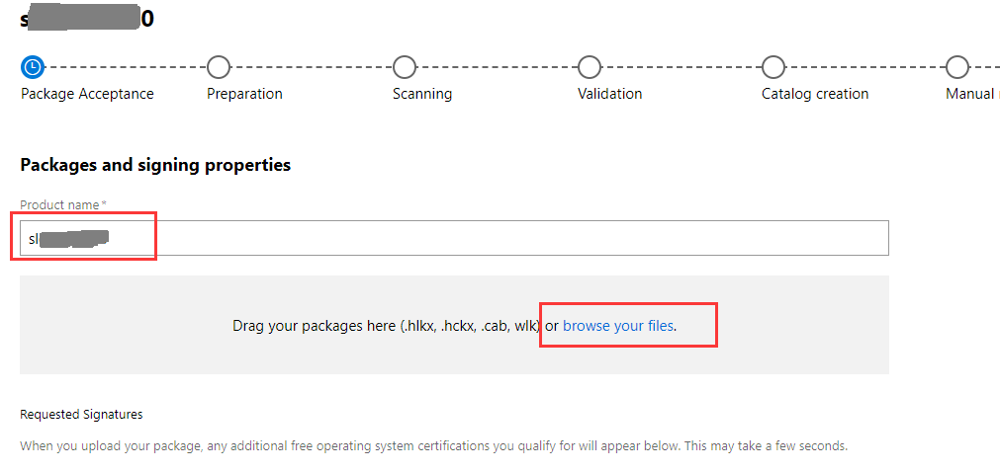

第三步，在【what type of device】选择一个（原则上随便选）类型，我们选择【Internal】，输入版本号和日期，然后提交。等待最终的结果。如下图所示。
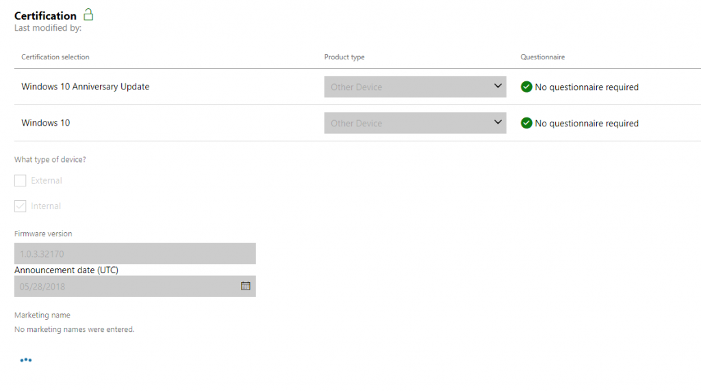
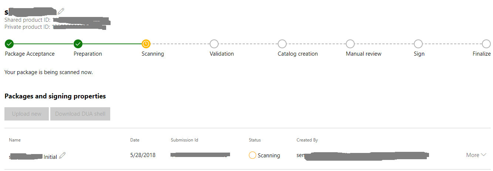

第四步，所有步骤都是自动进行，完成后，打开【More】按钮，通过下载按钮下载签名后的驱动文件。
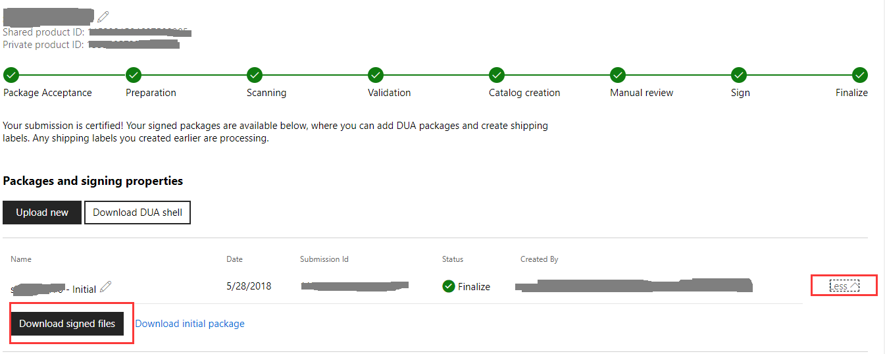

Category: 系统底层
小V
2019年7月5日
评论