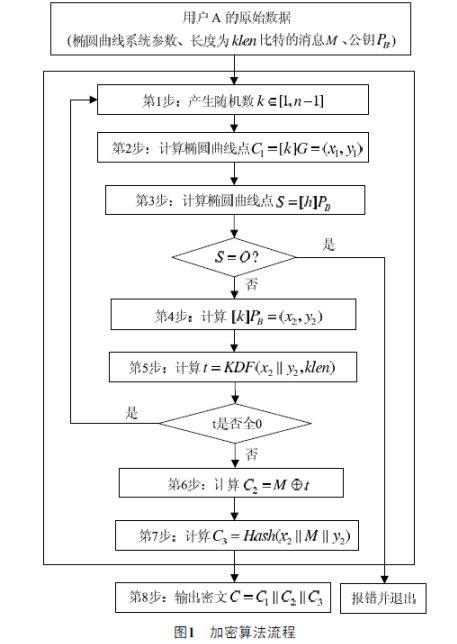
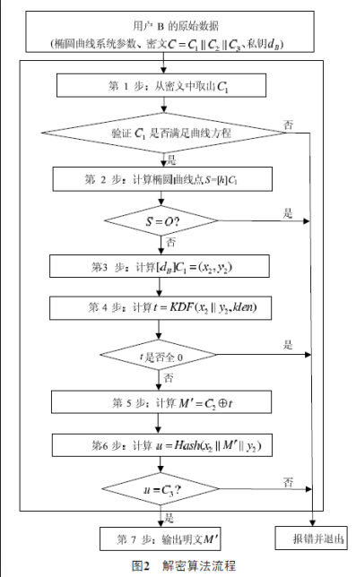

# [sm2加密算法](https://github.com/Arkq/SM2349/blob/master/src/SM2_ENC.c)
# [SM2加解密算法（基于GMSSL的C代码实现）](https://www.jianshu.com/p/24dd4d79630d)

Devil_Chen
0.095
2019.01.14 00:39:45
字数 1,129
阅读 22,942
## 一、椭圆曲线密码算法
椭圆曲线：是一类二元多项式方程，它的解构成一个椭圆曲线。

椭圆曲线参数：定义一条唯一的椭圆曲线。介绍其中两个参数G（基点）和n（阶）。G点(xG, yG)是椭圆曲线上的基点, 有限域椭圆曲线上所有其他的点都可以通过G点的倍乘运算计算得到，即P=[d]G， d也是属于有限域，d的最大值为素数n。

有限域上的椭圆曲线：椭圆曲线上的解不是连续的，而是离散的，解的值满足有限域的限制。有限域有两种，Fp和F2m。

E(Fq)：Fq上椭圆曲线E 的所有有理点(包括无穷远点O)组成的集合。

Fp：一个素整数的集合，最大值为P-1，集合中的值都是素数，里面元素满足以下模运算: a+b=(a+b) mod p 和 ab=(ab) mod p。

SM2：有限域Fp上的一条椭圆曲线，其椭圆曲线参数是固定值。

公私钥：P=[d]G，G是已知的，大数d为私钥，点P(XP, YP)为公钥。

SM2推荐使用素数域256位椭圆曲线：
-->EC_GROUP_new_by_curve_name(NID_sm2p256v1)

```cpp
//可以得出固定参数
//Sm2 中指定的参数 确定下y2 = x3 + ax + b 曲线
#define _P  "FFFFFFFEFFFFFFFFFFFFFFFFFFFFFFFFFFFFFFFF00000000FFFFFFFFFFFFFFFF"
#define _a  "FFFFFFFEFFFFFFFFFFFFFFFFFFFFFFFFFFFFFFFF00000000FFFFFFFFFFFFFFFC"
#define _b  "28E9FA9E9D9F5E344D5A9E4BCF6509A7F39789F515AB8F92DDBCBD414D940E93"
#define _n  "FFFFFFFEFFFFFFFFFFFFFFFFFFFFFFFF7203DF6B21C6052B53BBF40939D54123"
#define _Gx "32C4AE2C1F1981195F9904466A39C9948FE30BBFF2660BE1715A4589334C74C7"
#define _Gy "BC3736A2F4F6779C59BDCEE36B692153D0A9877CC62A474002DF32E52139F0A0"
```
OpenSSL部分涉及代码
```cpp
//初始化一个空算法组
EC_GROUP *group = EC_GROUP_new(EC_GFp_mont_method());
//初始化一个推荐椭圆曲线的算法组
EC_GROUP *group = EC_GROUP_new_by_curve_name(NID_sm2p256v1);
//上下文
BN_CTX *ctx = BN_CTX_new();
//创建EC_KEY，使用推荐椭圆曲线
EC_KEY *ec_key  = EC_KEY_new_by_curve_name(NID_sm2p256v1)
//生成公钥私钥
EC_KEY_generate_key(ec_key);
//设置私钥
EC_KEY_set_private_key(ec_key, d);
//设置公钥
EC_KEY_set_public_key(ec_key, P);
//通过ec_key获取算法组
EC_GROUP *ec_group = EC_KEY_get0_group(ec_key);
//获取基点G
EC_POINT * G = EC_GROUP_get0_generator(ec_group);
//大数初始化
BIGNUM *rand = BN_new();
//EC_POINT初始化
EC_POINT *P = EC_POINT_new(ec_group);
//获取坐标点p的x，y值
EC_POINT_get_affine_coordinates_GFp(ec_group,p,x,y,ctx);
//Gets the order of a EC_GROUP -- n阶 对应上面固定参数的_n
EC_GROUP_get_order(ec_group, order, ctx);
//随机数生成
do {
     BN_rand_range(rand,order);
} while (BN_is_zero(rand));
//大数转二进制
int len = BN_bn2bin(bn, outChar);
//获取坐标点p转大数bn
EC_POINT_point2bn(ec_group, p, POINT_CONVERSION_COMPRESSED, bn, ctx);
//点的乘积  lP = P * rand
EC_POINT_mul(ec_group, lP, NULL, P, rand, ctx);
//验证点C1是否在椭圆曲线上
EC_POINT_is_on_curve(ec_group, c1, ctx);
```

## 二、SM2加密算法（手动实现和使用GMSSL库实现）
PS：加解密中，加密时椭圆曲线点C1转换方式必须和解密时椭圆曲线点C1转换方式一致，否则无法解出C1。
### 1、手动实现
流程


算法：

1、产生随机数k, k的值从1到n-1；
```cpp
    BIGNUM *n,*k;
    n = BN_new();
    k = BN_new();
    EC_GROUP_get_order(ec_group, n, ctx);
    do {
        BN_rand_range(k,n);
    } while (BN_is_zero(k));
```    
2、计算椭圆曲线点C1=[k]G=(x1,y1), 将C1使用EC_POINT_point2oct转换成比特串；
```cpp
    //获取基点G
    const EC_POINT *G = EC_GROUP_get0_generator(ec_group);
    EC_POINT *c1 = NULL;
    c1 = EC_POINT_new(ec_group);
    unsigned char c1bin[65];
    unsigned long c1binlen = 65;
    EC_POINT_mul(ec_group, c1, NULL, G, k, ctx);
    EC_POINT_point2oct(ec_group, c1, POINT_CONVERSION_UNCOMPRESSED, c1bin, c1binlen, ctx);
```    
3、 验证公钥PB, 计算S=[h] PB，如果S是无穷远点，出错退出；
```cpp
    EC_POINT_is_on_curve(ec_group, PB, ctx);
    EC_POINT_is_at_infinity(ec_group, s);
```
4、计算(x2,y2)=[k] PB
```cpp
    EC_POINT *tempPoint = EC_POINT_new(ec_group);
    BIGNUM *x2 = BN_new();
    BIGNUM *y2 = BN_new();
    EC_POINT_mul(ec_group, tempPoint, NULL, pb, k, ctx);
    EC_POINT_get_affine_coordinates_GFp(ec_group,
                                        tempPoint, x2, y2, ctx);
```                                        
5、计算t=KDF(x2||y2, klen), KDF是密钥派生函数，klen是明文长度。
```cpp
    unsigned char x2y2[64] = {0};
    unsigned long x2y2len = 0;
    //x2||y2
    x2y2len += BN_bn2bin(x2, x2y2);
    x2y2len += BN_bn2bin(y2, &x2y2[32]);
    unsigned char t[klen];
    unsigned long tlen = klen;
    kdf(EVP_sm3(), x2y2, sizeof(x2y2), t, &tlen);
```    
6、计算C2=M^t （此处^为异或）
```cpp
    unsigned char c2[tlen];
    unsigned long c2len = 0;
    for (int i = 0; i < tlen; i ++) {
        c2[i] = M[i] ^ t[i];
        c2len++;
    }
```    
7、 计算C3=Hash(x2||M||y2)
```cpp
    unsigned char c3[32];
    unsigned long c3len = 32;
    unsigned char tempC3[x2y2len+klen];
    BN_bn2bin(x2, tempC3);
    BN_bn2bin(y2, &tempC3[32+klen]);
    memcpy(&tempC3[32], M, klen);
    sm3(tempC3, x2y2len+klen, c3);
```    
8、 输出密文C=C1||C3||C2。
```cpp
    unsigned char c[c1binlen + c2len + c3len];
    unsigned long clen = c1binlen + c2len + c3len;
    memcpy(c, c1bin, c1binlen);
    memcpy(&c[c1binlen], c3, c3len);
    memcpy(&c[c1binlen+c3len], c2, c2len);
注：密文分为C1,C2,C3,三部分，C1长度是65字节（具体根据转换方式），C2是明文的长度，C3是32字节（Hash使用sm3）。
注：C1 || C2 || C3 的意思就是拼在一起，而不是做什么或运算
```

根据国密推荐的SM2椭圆曲线公钥密码算法，首先产生随机数计算出曲线点C1，2个32byte的BIGNUM大数，即为SM2加密结果的第1部分（C1）。第2部分则是真正的密文，是对明文的加密结果，长度和明文一样（C2）。第3部分是杂凑值，用来效验数据（C3）。按国密推荐的256位椭圆曲线，明文加密结果比原长度会大97byte（C1使用EC_POINT_point2oct转换）。
注：通过密钥派生函数计算，才能进行第6步的按位异或计算。  

### 2、使用GMSSL库实现
基于GmSSL 2.5.4 - OpenSSL 1.1.0d 3 Sep 2019
```cpp
/**
 使用gmssl SM2加密
 
 @param inData 需要加密的数据
 @param inDataLen 需要加密的数据长度
 @param pubKey 公钥（point2oct）
 @param pubKeyLen 公钥长度
 @param encryptData 加密后的数据
 @return 0：成功/非0：失败
 */
 int sm2EncryptWithGmssl(
                       unsigned char *inData,
                       unsigned long inDataLen,
                       unsigned char *pubKey,
                       unsigned long pubKeyLen,
                       SM2CiphertextValue **encryptData)
{
    int resultCode = Result_OK;
    //公钥
    EC_KEY *ec_key = NULL;
    //公钥
    EC_POINT *publicKey = NULL;
    //ec_group
    EC_GROUP *ec_group = NULL;
    //ctx
    BN_CTX *ctx = NULL;


    //判断输入参数是否为空
    if (inData == NULL || inDataLen == 0 || pubKey == NULL || pubKeyLen == 0 || encryptData == NULL) {
        resultCode = Result_InputErr;
        goto err;
    }
    
    //获取公钥
    ctx = BN_CTX_new();
    ec_group = EC_GROUP_new_by_curve_name(NID_sm2p256v1);
    publicKey = EC_POINT_new(ec_group);
    int mark = EC_POINT_oct2point(ec_group, publicKey, pubKey, pubKeyLen, ctx);
    if (mark != 1) {
        resultCode = Result_EncErr;
        goto err;
    }
    
    //初始化数据
    ec_key = EC_KEY_new_by_curve_name(NID_sm2p256v1);
    EC_KEY_set_public_key(ec_key, publicKey);
    
    //调用gmssl SM2加密
    if (!(*encryptData = SM2_do_encrypt(EVP_sm3(), inData, inDataLen, ec_key))) {
        resultCode = Result_EncErr;
        goto err;
    }
    
err:
    if (ec_key != NULL) {
        EC_KEY_free(ec_key);
    }
    if (ec_group != NULL) {
        EC_GROUP_free(ec_group);
    }
    if (ctx != NULL) {
        BN_CTX_free(ctx);
    }
    if (publicKey != NULL) {
        EC_POINT_free(publicKey);
    }
    return resultCode;
}
```
## 三、SM2解密算法
### 1、手动实现
流程


算法：
1、从密文比特串C=C1||C3||C2中取出C1， 将C1转换成椭圆曲线上的点；
```cpp
    #define POINT_BIN_LENGTH 65

    unsigned char c1Bin[POINT_BIN_LENGTH];
    unsigned long c1Binlen = POINT_BIN_LENGTH;
    memcpy(c1Bin, encrypt(密文), POINT_BIN_LENGTH);
    EC_POINT  *c1 = EC_POINT_new(ec_group);
    EC_POINT_oct2point(ec_group, c1, c1Bin, c1Binlen, ctx);
```    
2、验证C1, 计算S=[h] C1，如果S是无穷远点，出错退出；
```cpp
    int resultCode = EC_POINT_is_on_curve(ec_group, c1, ctx);
    if (resultCode) {
        printf("验证C1成功\n");
    }else{
        printf("验证C1失败\n");
    }
```    
3、计算(x2,y2)=[dB] C1
```cpp
    EC_POINT *dC1 = EC_POINT_new(ec_group);
    EC_POINT_mul(ec_group, dC1, NULL, c1, d, ctx);
    BIGNUM *x2 = BN_new();
    BIGNUM *y2 = BN_new();
    EC_POINT_get_affine_coordinates_GFp(ec_group,
                                        dC1, x2, y2, ctx);
```
4、计算t=KDF(x2||y2, klen), KDF是密钥派生函数，如果t是全0比特串，出错退出。
```cpp
    unsigned char x2y2[64] = {0};
    unsigned long x2y2len = 0;
    //x2||y2
    x2y2len += BN_bn2bin(x2, x2y2);
    x2y2len += BN_bn2bin(y2, &x2y2[32]);
    //原文长度klen
    unsigned long klen = encryptLen - (c1Binlen+c3len);
    
    unsigned char t[klen];
    unsigned long tlen = klen;
    sm3_kdf1(EVP_sm3(), x2y2, sizeof(x2y2), t, &tlen);
```    
5、从C=C1||C3||C2中取出C2，计算M’= C2+t。
```cpp
    unsigned char c2[tlen];
    memcpy(c2, encrypt+c1Binlen+c3len, tlen);
    
    //原文
    unsigned char M[tlen+1];
    unsigned long Mlen = 0;
    for (int i = 0; i < tlen; i ++) {
        M[i] = c2[i] ^ t[i];
        Mlen++;
    }
    M[tlen] = '\0';
    printf("M'-->%s\n",M);
```    
6、计算u=Hash(x2||M’||y2)，比较u是否与C3相等，不相等则退出。
7、输出明文M’。

### 2、使用GMSSL库实现
基于GmSSL 2.5.4 - OpenSSL 1.1.0d 3 Sep 2019
```cpp
/**
 使用GMSSL解密
 
 @param cv 加密数据
 @param d 私钥
 @param decryptData 解密数据
 @param decryptDataLen 解密数据长度
 @return 0成功/其它失败
 */
  int sm2DecryptWithGmssl(SM2CiphertextValue *cv,BIGNUM *d,unsigned char *decryptData,unsigned long *decryptDataLen)
{
    int resultCode = 0;
    BN_CTX *ctx = NULL;
    
    EC_GROUP *ec_group = NULL;
    EC_KEY *ec_key = NULL;
    //bn_prime
    BIGNUM *prime = NULL;
    
    //判断输入参数是否为空
    if (cv == NULL || d == NULL || decryptData == NULL) {
        resultCode = Result_InputErr;
        goto end;
    }

    
    //初始化
    ctx = BN_CTX_new();
    ec_group = EC_GROUP_new_by_curve_name(NID_sm2p256v1);
    //设置私钥
    ec_key = EC_KEY_new();
    EC_KEY_set_group(ec_key, ec_group);
    EC_KEY_set_private_key(ec_key, d);
    //prime
    prime = BN_new();
    BN_hex2bn(&prime,SM2_n);
    
    //C = C1||C3||C2 -- C为加密数据encryptData
    if (!SM2_do_decrypt(EVP_sm3(), cv, decryptData, decryptDataLen, ec_key))
    {
        resultCode = Result_DecErr;
        goto end;
    }
    printf("\n Decrypt Data-->%s\n",decryptData);
end:
    if (ctx != NULL) {
        BN_CTX_free(ctx);
    }
    if (ec_group != NULL) {
        EC_GROUP_free(ec_group);
    }
    if (ec_key != NULL) {
        EC_KEY_free(ec_key);
    }
    if (prime != NULL) {
        BN_free(prime);
    }
    if (d != NULL) {
        BN_free(d);
    }
    return resultCode;
}
```
## 四、结论
想要成功解密出原文，必须是公钥PB和私钥dB是匹配的，即满足PB=[dB]G,原文经过两次与同一比特串的异或计算，结果还是原文。