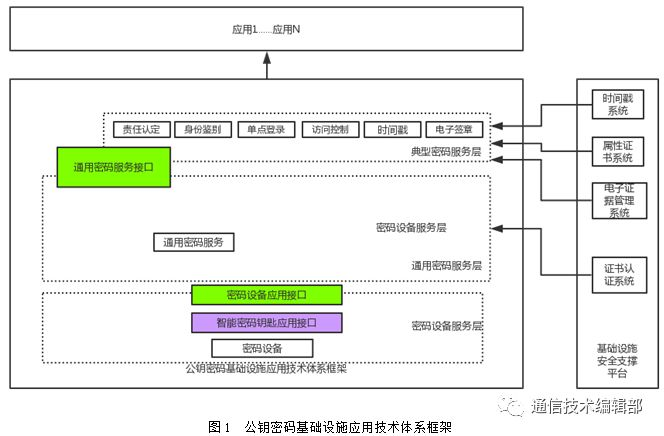
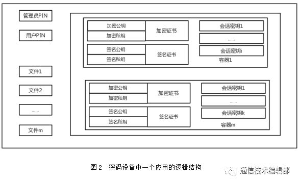
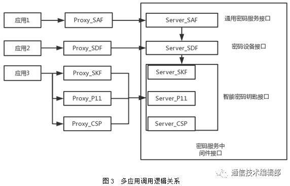
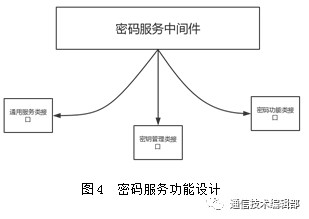
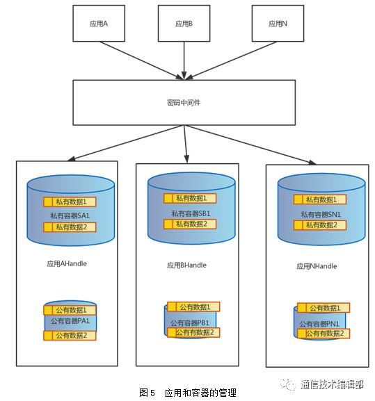
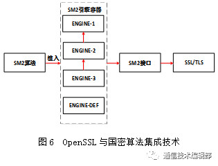

摘要：针对国外通用密码算法存在安全漏洞和安全强度不可控的现状,以及当前跨操作系统和多种应用的个性化安全需求，迫切需要基于国密标准的密码中间件能够提供一种通用的、标准化的解决方案。密码服务中间件的主要设计思想是将密码服务与中间件技术相结合，将密码服务从整个工程应用中解耦出来成为通用的模块，从而对应用提供统一的密码服务。这样既可以促进密码服务的标准化，提高模块的可重用性，也降低了第三方应用厂家的开发难度，拓宽了适用范围。

正文内容：

0 引言

针对国外通用密码算法存在安全漏洞和安全强度不可控的现状[1]，以及当前跨操作系统和多种应用的个性化安全需求，迫切需要基于国密标准的密码中间件提供一种普适性的、标准化的解决方案。

从当前应用安全加固时所遇到情况分析看，安全厂家需要针对每款应用以单独的加密软件包以及安全API接口形式提供给应用开发团队。各应用由于其自身业务特点或安全需求，所需的安全API接口形态各异，往往应用的需求会导致加密软件包和安全API接口发生变化[2]。此外，应用开发团队必须具备渊博的密码学知识，才能灵活调用安全API接口提供的各种密码功能。这样接口调用杂乱无章，各加密软件包适用性也较差。

基于国密标准的密码服务中间件是以国产密码技术和密码功能为基础，以密码设备为载体，以密码服务为核心，向系统和应用提供加密、解密、签名、认证以及相应密钥管理、安全协议等密码服务支持的工程应用系统。从接口设计来讲，既要倾向应用的适用性，也要考虑密码设备的支持性和升级更新的兼容性。

1　背景概述

1.1　密码服务

本文拟提出的密码服务的定义为：密码服务是安全服务中具备密码功能的服务，向应用或系统提供加密、解密、签名、认证等密码函数支持，以实现对信息数据的保护、签名以及访问实体身份认证等。

1.2　中间件

中间件是介于操作系统和应用程序之间的模块，面向信息系统交互，集成过程中的通用部分的集合，屏蔽了底层的通讯、交互、连接等复杂又通用化的功能，以相对独立的形式存在并向应用程序提供调用接口。应用程序直接采用中间件提供的接口进行连接和交互即可，避免了大量的重复代码开发，节约了人工成本。

中间件通常具有以下特点：

（1）通用性；

（2）可移植性；

（3）兼容性；

（4）易用性；

（5）标准化。

1.3　密码服务中间件

密码服务中间件是将中间件技术与密码服务相结合，实现密码资源共享，并为应用开发者提供标准和灵活的调用接口。密码服务中间件可降低应用程序使用密码服务和集成密码设备的难度，同时提高灵活性。一方面，解决应用程序对密码设备的独占性，密码设备可为多个应用提供密码服务；另一方面，应用程序与密码设备、密码设备的软件包之间成为一种松耦合关系，提高了软硬件设备和操作系统的兼容性。

密码服务中间件试图屏蔽各平台（含硬件平台和操作系统）的差异性，从而提供一种通用连接技术。密码设备在各平台上对应用程序达到真正的即插即用，从而使应用程序可以更便捷地使用密码服务。

密码服务中间件的特点：

（1）内部实现细节不对外呈现，仅开放调用接口为应用程序提供通用密码服务；

（2）使用鉴权手段对各应用的服务请求进行访问控制。

1.4　相关规范和标准

目前，密码服务的规范和标准已经基于成熟。采用基于X.509证书的公钥基础设施（PKI）提供安全服务的方案具有普适性，但目前密码服务中间件尚无统一的国际标准。大部分密码服务中间件都是基于某操作系统或某公司产品的扩展，并在其产品应用框架内提供PKI服务。当前，业界比较流行的有由RSA、IETF、Microsoft、Intel、Entrust、等提出的一些解决方案。

目前，国际处于领先地位的是RSA的PKCS#11[3]、Microsoft的CryptoAPI（含CSP）以及Intel的公用数据安全框架CDSA。国内较为领先的有卫士通的WestoneCSP和东方通科技的TongSEC。

此外，国内也提出了很多密码服务的相关标准。例如，智能密码钥匙密码应用接口规范（SKF）、密码设备应用接口规范（SDF）、通用密码服务接口规范（SAF）和证书应用综合服务接口规范（SOF）等。

2　系统设计

2.1　体系架构

密码服务体系架构就是构成密码服务系统的密码设备、密码服务中间件（密码服务接口）以及运行环境相关的配置、调用和相互服务的依赖关系[4]。可以理解为是从一个或多个必须执行某些密码操作的应用程序开始，到一个或多个密码设备结束的完整运行过程。

密码服务体系架构是基于国密标准的公钥密码基础设施应用技术体系框架。其中，和密码服务中间件强相关的两个接口如下。

（1）密码设备应用接口

在公钥密码基础设施应用技术体系框架中，密码设备服务层包含密码机、密码卡、智能密码终端等密码设备，并通过国密标准规定的密码设备应用接口向通用密码服务层提供与密码设备相关的基础密码服务。

基础密码服务包括密钥生产、单一的密码运输、文件管理等服务。

（2）通用密码服务接口

通用密码服务通过统一的密码服务接口，向典型密码服务层和应用层提供证书解析、证书认证、信息的机密性、完整性和不可否认性等通用密码服务，将上层应用的密码服务请求转化为具体的基础密码操作请求，通过统一的密码设备应用接口调用相应的密码设备实现具体的密码运输和密钥操作。

从密码服务的分层关系看，可分为典型密码服务层、通用密码服务层和密码设备服务层。以上3层构成了密码服务的服务端，而应用层构成了应用程序的客户端。

公钥密码基础设施应用技术体系框架图，如图1所示。

应用由管理员个人识别密码（PIN）、用户个人识别密码（PIN）、文件和容器组成，可以存在多个文件和多个容器。各应用维护对应的与管理员个人识别密码（PIN）和用户个人识别密码（PIN）相关的权限状态。密码设备中一个应用的逻辑结构图，如图2所示。

多应用调用逻辑关系示意图，如图3所示。

2.2　设计与实现

密码服务中间件是处于服务接口层和密码设备层之间的中间层软件，主要功能有两点。

（1）向上提供符合密码服务接口规范的标准接口，满足密码服务接口的应用功能；

（2）向下屏蔽密码设备的接口特征和使用细节，实现信息的可靠交换。

这样对应用开发者来说，简化了调用访问底层系统资源和操纵有关软硬件资源的难度和复杂度，并提高了系统的安全性和稳定性。

密码服务中间件包括以下三类接口：

（1）通用服务类接口。提供密码服务中间件的管理功能，提供初始化、会话的创建、用户的登录，向终端操作系统提供设备信息、设备句柄、安全存取控制等功能。

（2）密钥管理类接口。对密钥进行统一管理，提供密钥产生、配置、导入/导出、销毁等功能。

（3）密码功能类接口。向上对应用系统提供标准的接口，完成加密、解密、签名/验证等各类密码操作服务。

密码服务功能设计如图4所示。

3　内部架构

3.1　应用和容器的管理

密码服务中间件以应用为单位，每个应用分配固定的应用Handle，每个应用使用应用Handle创建自己的容器，而容器的属性可以设置为公开或私有。私有容器只有本应用可以访问，公有容器可以为其他应用访问。

应用在私有容器中创建自己的私有秘密数据、密钥、证书、资源配置等信息。

应用和容器的管理示意图，如图5所示。

3.2　接口设计

密码服务接口层的设计，目前的标准有CSP、PKCS#11、SKF等。目前，CSP可以调用PKCS#11，所以目前密码服务接口层的设计参考CSP的接口设计。

4　关键技术

4.1　密码设备

密码设备是密码服务的基础和载体，基础功能是能够存储秘密信息和执行密码运算。现有的密码设备分为软件密码设备和硬件密码设备。

软件密码设备有OpenSSL、卫士通研发的软卡。

硬件密码设备有嘉微和华大的加密TF卡和I海思的麒麟SoC片载inSE。其中，硬件密码设备的识别和启用方式又分为有专用驱动或无专用驱动两类。

密码服务中间件要支撑密码设备的3种使用场景：

（1）由软件密码设备实现全部的数据存储和密码运算；

（2）由硬件密码设备实现全部的数据存储和密码运算；

（3）由软件密码设备和硬件密码设备协同完成数据存储和密码运算。

4.2　支持国密算法

OpenSSL使用Engine技术集成第二、三方提供的软件密码算法库或者硬件密码算法设备。使得上层功能模块可以透明调用密码算法进行加解密或签名验签。OpenSSL提供了一个通用的加解密、签名验签接口，能够调用绝大部分密码算法库或者硬件密码算法设备。OpenSSL为每种密码算法定义一个引擎容器Engine，每个引擎容器中包含一个引擎列表和一个默认引擎，还有一些控制信息。引擎为密码算法提供服务，OpenSSL增加3个引擎容器，支持国密算法SM2/3/4。以SM2为例，OpenSSL与国密算法集成技术原理[5]如图6所示。

4.3　遵循国密标准通用密码服务接口

通用密码服务接口在公钥密码基础设施支撑的前提下，向应用系统和典型密码服务层提供各类通用的密码服务。遵循国密标准有利于密码服务接口产品的开发，有利于应用系统在密码服务过程中的集成和实施，有利于实现各应用系统的互联互通。

4.4　支持多应用并发

（1）对多进程的支持

具体表现为：同一时刻，密码服务中间件可以支持上层多个应用的密码服务请求，或一个应用中的多线程密码服务请求[6]。

（2）队列调度

密码服务中间件支持队列的优先级调度。优先级可以基于应用的抢占式或业务的优先级。

5　结　语

内外主流中间件产品的安全功能无论是传输层安全还是数据层安全，都是使用国外通用密码算法实现的。由于国外通用密码算法存在安全后门，安全性不可控，且国外密码算法的密钥长度受出口限制，所以安全强度不可控。基于国密标准安全中件的安全功能设计在使用国密标准的基础上，实行传输层安全和应用数据安全，能很好地解决目前中间件产品的安全不可控问题和安全功能欠缺问题。

参考文献：

[1] 李琪林,周明天.可信中间件——技术现状和发展[J].计算机科学,2008,35(06):15-19.

[2] 徐文拴,辛运帏,卢桂章.普适计算中间件技术的研究与进展[J].计算机科学,2007,34(11):1-5.

析[J].信息安全与通信保密,2007(04):87-88.

[3] 刘刚,李峥,司渐美.两种密码中间件模块PKCS#11与CSP的对比分析[J].信息安全与通信保密,2007(04):87-88.

[4] 陶建平,曹光宇,张永福.可信密码系统中间件开发框架研究与实现[J].信息工程大学学报,2010,11(02):243-247.

[5] 刘迪,牟鹏,董爱强.基于国密算法安全中间件的安全功能研究与设计[J].网络安全技术与应用,2017(04):74-78.

[6] 李林,杨先文,郑斌.多任务密码服务系统设计与实现[J].信息工程大学学报,2013,14(01):96-102.

作者：王俊人，龚乐中

单位：成都卫士通信息产业股份有限公司，四川 成都 610041

作者简介：王俊人，男，硕士，工程师，主要研究方向为安全加密系统、安全移动办公、

安全集群对讲；

龚乐中，男，硕士，工程师，主要研究方向为安全移动办公、安全PoC系统、安全集群对讲。

本文刊登在《通信技术》2018年第4期（转载请注明出处，否则禁止转载）